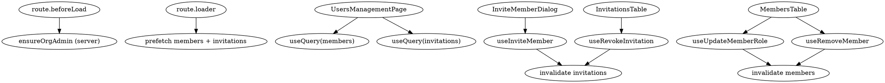

# Users Management page — UI + code refactor

## Goal

Improve the UX and code quality of `packages/app/src/routes/_authenticated/_dashboard/users-management.tsx`. Today the route is one ~430-line file using `Record<string, any>`, manual `useEffect`/`useState` fetching, and an inline success/error banner. The UX improvements: move invite into a dialog, require confirmation on role changes, and make the tables full-bleed to match other dashboard tables.

## Non-goals

- No changes to better-auth server-side config or permissions (including `ensureOrgAdmin`).
- No new features beyond what the existing page supports (invite, list, revoke, role change, remove).
- No merging of invitations into the members table.

## UX changes

1. **Invite member is a Dialog.** The top-level "Invite member" card is removed. The Members card exposes a `CardAction` with an "Invite member" button; clicking opens a `Dialog` containing the email input, role select, and "Send invite" button. Success closes the dialog and fires a toast. Errors surface as toasts as well (the dialog stays open so the user can retry).
2. **Role change requires confirmation.** When an admin picks a new role from the row's `Select`, an `AlertDialog` asks `"Change {name}'s role from {old} to {new}?"`. Confirm runs the mutation; cancel leaves the row's role unchanged.
3. **Full-bleed tables.** Both tables render inside `<Card inset="flush-content">` so the table runs edge-to-edge, matching `TopFailingJobsTable` / `ActiveBranchesTable` usage in `repos.tsx:108`.
4. **Toast feedback.** All success and error messages (invite, revoke, role change, remove) go through `toast` from `sonner`. The existing Toaster is mounted in `__root.tsx:117`. The old inline `inviteMessage` state is removed.
5. **Loading.** While the members query is pending, render a small block of `Skeleton` rows in place of the `DataTable` rather than a centered spinner. `DataTable` does not need to change — the table component is swapped for skeletons at the call site while `isPending`. Pending-invitations card is only rendered when there is at least one pending invitation (unchanged from today).

## Code structure

New directory: `packages/app/src/components/users-management/`

- `queries.ts` — `queryOptions` factories and mutation hooks. Exports:
  - `membersQueryOptions()` / `invitationsQueryOptions()` — both unwrap `{data, error}` from `authClient.organization.*` in the `queryFn`, throwing on error so TanStack Query sees a rejected state.
  - Types derived from the return types of `authClient.organization.listMembers` / `listInvitations` (via `Awaited<ReturnType<...>>` + indexing into `data`). No `any`, no `Record<string, any>`.
  - `useInviteMember`, `useRevokeInvitation`, `useUpdateMemberRole`, `useRemoveMember` — `useMutation` hooks that call into `authClient.organization.*` and, on success, invalidate the relevant query keys.
- `invite-member-dialog.tsx` — Dialog triggered by the `CardAction` button. Holds its own `open` state plus `email`/`role` form state. Uses `useInviteMember`. On success: toast, reset form, close. On error: toast.
- `members-table.tsx` — Renders the `DataTable` and owns the role-change confirmation `AlertDialog` and remove `AlertDialog`. Receives `members` + `currentUserId` as props. "Last owner" + "is self" rules keep their current behavior (no role change, no remove).
- `invitations-table.tsx` — Renders the pending invitations `DataTable` with the revoke `AlertDialog`.

The route file `users-management.tsx` keeps:
- `ensureOrgAdmin` server fn and the route's `beforeLoad` guard.
- `loader` that prefetches both queries via `queryClient.ensureQueryData`.
- `UsersManagementPage` component: page title, description, `<MembersCard>` wrapper, conditional `<InvitationsCard>` wrapper. Target size: under ~80 lines.

## Data flow



Query keys:
- `["org", "members"]`
- `["org", "invitations"]`

Both queries are scoped to the active organization implicitly (better-auth uses the session's active org). If we later need to distinguish orgs we add the org id into the key, but that's out of scope here.

## Role-change confirm UX

The select is a controlled `Select` whose displayed value is the row's current role. When the user picks a different value:

1. The component stores `{ memberId, currentRole, nextRole, memberName }` in local state and opens an `AlertDialog`.
2. The `Select` itself does not update visually — it still shows the current role.
3. On confirm: run `useUpdateMemberRole`, close dialog, toast. React-query invalidation repopulates the row with the new role.
4. On cancel: close dialog, no change.

This means we never show a "phantom" new role before confirmation, which avoids the UI lying about state.

## Error handling

- All mutations surface errors as `toast.error(err.message ?? "Something went wrong")`.
- Query errors render a small error message inside the card (matches the rest of the app's pattern of graceful degradation). A retry button is not required — the user can refresh. Query retries stay at the TanStack Query defaults.
- The invite dialog does not block on transient failures: it shows a toast and keeps the dialog open so the user can edit and retry.

## Types

Minimal type surface in `queries.ts`:

```ts
type ListMembers = Awaited<ReturnType<typeof authClient.organization.listMembers>>;
type Member = NonNullable<ListMembers["data"]>["members"][number];
// analogous for Invitation
```

If better-auth's client returns `data` as `T[]` in some shapes and `{members: T[]}` in others, the `queryFn` normalizes both into the same shape (`T[]`), and the exported `Member`/`Invitation` types reflect the normalized shape. This removes the "may return data as an array directly or nested" ambiguity the current file has to deal with inline.

## Testing

Manual (Vite dev server at :5173):
- Invite succeeds: dialog closes, toast appears, invitations card appears/updates.
- Invite fails (duplicate email): toast error, dialog stays open.
- Role change: select opens → confirm dialog → confirm updates row; cancel keeps old value.
- Remove: confirm dialog → row disappears; self/last-owner rows have no Remove button.
- Revoke: confirm dialog → invitation disappears; invitations card disappears when empty.
- Non-admin: redirected away by `beforeLoad`.

## Out of scope / future

- Bulk invite, CSV import, pagination, filtering, sorting.
- Merging invitations + members into one unified table.
- Auditing / activity log.
