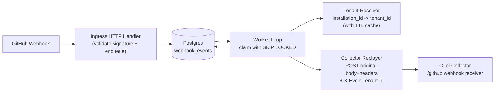

# Ingress Service

The ingress service is the durable webhook entrypoint for Citric.

It receives GitHub webhooks, verifies signature, stores the original payload in Postgres, and asynchronously replays the event to the collector with resolved tenant context.

## Why it exists

- Keep the collector focused on telemetry transformation/export.
- Keep business logic (tenant resolution, retries, dead-letter handling) outside the collector.
- Provide at-least-once processing with durable queue semantics.

## Architecture



## Runtime flow

### 1. Ingress HTTP path

1. Accept `POST` on `INGRESS_PATH` (default `/webhook/github`).
2. Verify GitHub signature using `INGRESS_WEBHOOK_SECRET`.
3. Read `X-GitHub-Delivery` as idempotency key.
4. Compute payload SHA-256 and enqueue into `webhook_events`.
5. Return:
- `202` when inserted.
- `200` when duplicate with same body hash.
- `409` when duplicate key has different body hash.

### 2. Worker processing path

1. Claim due rows using `FOR UPDATE SKIP LOCKED`.
2. Parse webhook event from stored bytes (`github.ParseWebHook`).
3. If event type is `installation` or `installation_repositories`, forward original headers/body to app install-events endpoint (`INGRESS_INSTALLATION_EVENTS_URL`) and stop.
4. For workflow events, extract `installation.id` and resolve tenant from app API (`INGRESS_TENANT_RESOLUTION_URL`) using HMAC auth headers (`X-Everr-Ingress-Timestamp`, `X-Everr-Ingress-Signature-256`).
5. Replay original headers/body to collector, adding `X-Everr-Tenant-Id`.
6. Mark event state:
- `done` on success.
- `failed` with exponential backoff on retryable errors.
- `dead` on terminal errors or after max attempts.

### 3. Cleanup path

A periodic cleanup job deletes old rows in batches:

- `done` rows older than `INGRESS_RETENTION_DONE_DAYS`.
- `dead` rows older than `INGRESS_RETENTION_DEAD_DAYS`.

## Data model

Queue table migration:

- [migrations/001_create_webhook_events.sql](migrations/001_create_webhook_events.sql)

Key fields:

- `event_id`: vendor delivery id (idempotency key)
- `body_sha256`: duplicate conflict detection
- `headers` + `body`: original request replay fidelity
- `status`, `attempts`, `next_attempt_at`, `locked_until`: worker scheduling and retries

## Key components

- [main.go](main.go): bootstrap and wiring.
- [http_handler.go](http_handler.go): ingress HTTP endpoint.
- [store.go](store.go): queue persistence/claim/finalize/cleanup.
- [processor.go](processor.go): process orchestration.
- [tenant.go](tenant.go): tenant lookup API client + TTL cache.
- [replayer.go](replayer.go): replay transport to collector.
- [worker.go](worker.go): worker loops.
- [config.go](config.go): env config parsing/validation.

## Configuration

Required:

- `INGRESS_POSTGRES_DSN`
- `INGRESS_WEBHOOK_SECRET`
- `INGRESS_COLLECTOR_URL`
- `INGRESS_TENANT_RESOLUTION_URL`
- `INGRESS_TENANT_RESOLUTION_SECRET`
- `INGRESS_INSTALLATION_EVENTS_URL`

Main optional settings (with defaults):

- `INGRESS_LISTEN_ADDR` (`:8081`)
- `INGRESS_PATH` (`/webhook/github`)
- `INGRESS_WORKER_COUNT` (`2`)
- `INGRESS_WORKER_BATCH_SIZE` (`10`)
- `INGRESS_MAX_ATTEMPTS` (`10`)
- `INGRESS_POLL_INTERVAL` (`2s`)
- `INGRESS_LOCK_DURATION` (`2m`)
- `INGRESS_REPLAY_TIMEOUT` (`30s`)
- `INGRESS_REPLAY_CONNECT_TIMEOUT` (`10s`)
- `INGRESS_TENANT_CACHE_TTL` (`1m`, set `0` to disable)
- `INGRESS_RETENTION_DONE_DAYS` (`7`)
- `INGRESS_RETENTION_DEAD_DAYS` (`30`)
- `INGRESS_CLEANUP_INTERVAL` (`1h`)

## Local run

Run with Docker Compose from repo root:

```bash
docker compose up --build ingress collector postgres clickhouse
```

Run tests:

```bash
cd ingress
go test -mod=mod ./...
```
