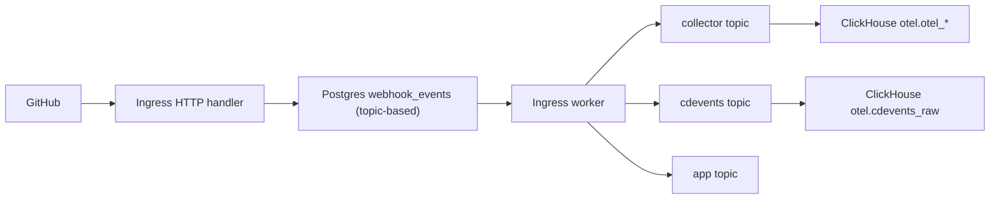

# CDEvents Bridge Service

## Goal
Add a new Go service at `cdevents/` that receives GitHub webhooks replayed by ingress, transforms them into CDEvents, and stores them in ClickHouse.

The queue model should be:
- one `webhook_events` row per `(source, event_id, topic)`
- `topic` means downstream service
- each interested service gets its own queue entry

Topics currently in scope:
- `collector`
- `cdevents`
- `app` for installation-related events

## Core Design Change

Stop treating a webhook as one queue item shared by multiple downstreams.

Also stop storing per-target progress inside a shared row.

Instead:
- keep using `webhook_events`
- add a `topic` column
- enqueue one row per interested topic

That gives us:
- isolated retries per service
- no second queue table
- no `delivered_targets` bookkeeping
- a simple mental model: one row equals one service delivery attempt

## Proposed Architecture

## Why This Model Is Better

With one row per topic:
- collector failure does not block cdevents retries
- cdevents failure does not cause collector replay again
- app installation forwarding is modeled the same way as other downstreams
- retry state stays local to one service

This gives most of the benefits of isolated deliveries without adding a new table.

## Data Model

## 1. Extend `webhook_events`
Keep `webhook_events`, but add:
- `topic TEXT NOT NULL`
- `tenant_id BIGINT`

Suggested uniqueness:
- `UNIQUE (source, event_id, topic)`

This means the same GitHub delivery can create multiple rows:
- `(github, evt_123, collector)`
- `(github, evt_123, cdevents)`
- `(github, evt_456, app)`

## 2. Meaning of `topic`
`topic` identifies the destination service that should consume the row.

Suggested values:
- `collector`
- `cdevents`
- `app`

The worker uses `topic` to decide:
- whether tenant resolution is needed
- which downstream URL to call
- which headers to attach

## 3. Queue state
Each topic row keeps its own lifecycle:
- `queued`
- `processing`
- `failed`
- `done`
- `dead`

Each topic row owns its own:
- `attempts`
- `next_attempt_at`
- `last_error`
- `error_class`

## Ingestion Model

## 1. HTTP acceptance
On inbound GitHub webhook:
- validate signature
- require `X-GitHub-Delivery`
- hash payload once
- determine interested topics from event type
- insert one row per topic into `webhook_events`

Examples:

### Workflow run / workflow job events
Interested topics:
- `collector`
- `cdevents`

### Installation events
Interested topics:
- `app`

## 2. Topic routing rules
Ingress should decide topic fanout synchronously at enqueue time.

Suggested routing:
- `workflow_run` -> `collector`, `cdevents`
- `workflow_job` -> `collector`, `cdevents`
- `installation` -> `app`
- `installation_repositories` -> `app`

Unsupported event types:
- either drop before enqueue
- or enqueue no rows and return `202`

The simpler path is to decide topics before writing rows.

## Worker Model

## 1. One worker loop, topic-aware processing
The worker can still claim rows from one table, but processing becomes topic-specific.

For each claimed row:
1. parse the webhook
2. inspect `topic`
3. dispatch to the correct downstream behavior

## 2. Tenant resolution rules

### `collector`
- requires tenant resolution
- store `tenant_id` on the row after it is resolved
- reuse stored `tenant_id` on retry

### `cdevents`
- requires tenant resolution
- store `tenant_id` on the row after it is resolved
- reuse stored `tenant_id` on retry

### `app`
- installation events should not require tenant resolution
- forward original webhook directly to the app endpoint

This keeps topic behavior explicit and avoids overloading one path with every rule.

## 3. Dispatch behavior by topic

### Topic: `collector`
- replay webhook to collector
- inject `X-Everr-Tenant-Id`
- mark only the collector row `done` / `failed` / `dead`

### Topic: `cdevents`
- replay webhook to cdevents
- inject `X-Everr-Tenant-Id`
- mark only the cdevents row `done` / `failed` / `dead`

### Topic: `app`
- forward installation event webhook to app
- no tenant resolution required
- mark only the app row `done` / `failed` / `dead`

## CDEvents Service Plan

## 1. Add `cdevents/` service
Files:
- `cdevents/main.go`
- `cdevents/config.go`
- `cdevents/handler.go`
- `cdevents/transformer.go`
- `cdevents/writer.go`
- `cdevents/types.go`
- `cdevents/go.mod`
- `cdevents/Dockerfile`

Behavior:
- accept replayed webhook requests from ingress
- require `X-GitHub-Event`, `X-GitHub-Delivery`, `X-Everr-Tenant-Id`
- parse supported events
- transform to validated CDEvents
- batch-write rows to ClickHouse

## 2. Stable internal row model
Continue using:
- `tenant_id`
- `delivery_id`
- `event_kind`
- `event_phase`
- `event_time`
- `subject_id`
- `subject_name`
- `subject_url`
- `pipeline_run_id`
- `repository`
- `sha`
- `ref`
- `outcome`
- `cdevent_json`
- `raw_webhook_json`

## Event Coverage

Initial mappings:
- `workflow_run.requested` -> `pipelineRun.queued`
- `workflow_run.in_progress` -> `pipelineRun.started`
- `workflow_run.completed` -> `pipelineRun.finished`
- `workflow_job.in_progress` -> `taskRun.started`
- `workflow_job.completed` -> `taskRun.finished`

Deferred:
- `workflow_job.queued`

## ClickHouse Plan

## 1. Raw table
Create `otel.cdevents_raw` with explicit `tenant_id`.

## 2. Read table + MV
Create `app.cdevents` and `app.cdevents_mv`.

## 3. RLS
Apply row-level security using `tenant_id = toUInt64(getSetting('SQL_citric_tenant_id'))`.

## Ingress Refactor Plan

## 1. Schema changes
Update `ingress/migrations/001_create_webhook_events.sql` or add a new migration to:
- add `topic`
- add `tenant_id`
- replace unique key `(source, event_id)` with `(source, event_id, topic)`
- update claim indexes if needed

## 2. Enqueue changes
Change `enqueueEvent` so it:
- computes topics for the webhook
- inserts one row per topic
- treats duplicate/conflict semantics per `(source, event_id, topic)`

It should still detect body conflicts if the same delivery ID/topic pair is reused with a different payload hash.

## 3. Processor changes
Replace the shared “fan out inside one row” logic with topic dispatch:
- if topic is `collector`, process only collector delivery
- if topic is `cdevents`, process only cdevents delivery
- if topic is `app`, process only app forwarding

## 4. Config changes
Keep URLs explicit:
- `INGRESS_COLLECTOR_URL`
- `INGRESS_CDEVENTS_URL`
- `INGRESS_INSTALLATION_EVENTS_URL`

All configured topics should have a corresponding URL.

## Test Plan

## Unit tests

### Enqueue and routing
- `workflow_run` enqueues `collector` and `cdevents`
- `workflow_job` enqueues `collector` and `cdevents`
- `installation` enqueues only `app`
- `installation_repositories` enqueues only `app`
- duplicate insert with same body succeeds as duplicate per topic
- conflicting body hash is detected per topic

### Processor behavior
- `collector` topic resolves tenant and replays only to collector
- `cdevents` topic resolves tenant and replays only to cdevents
- `app` topic forwards only to app without tenant resolution
- collector failure does not affect cdevents row status
- cdevents failure does not affect collector row status
- app failure does not affect non-app rows
- retry on collector/cdevents reuses stored `tenant_id`

### CDEvents service
- supported mappings
- unsupported events return no rows
- handler validation
- writer batching and retry behavior

## Integration tests
- one `workflow_run` webhook creates two queue rows: `collector` and `cdevents`
- one installation webhook creates one queue row: `app`
- collector row can succeed while cdevents row fails and retries independently
- cdevents row can succeed while collector row fails and retries independently
- `workflow_run.completed` reaches `otel.cdevents_raw`
- `app.cdevents` remains tenant-filtered

## Rollout Sequence
1. Add `topic` and `tenant_id` to `webhook_events`.
2. Change enqueue logic to create one row per interested topic.
3. Refactor worker processing to dispatch by topic.
4. Validate isolated retries in local/dev.
5. Expand CDEvents coverage later if needed.

## Acceptance Criteria
- `webhook_events` remains the only durable queue table.
- Each interested service gets its own queue row.
- Collector, cdevents, and app retries are isolated by topic.
- Collector success does not cause cdevents to be skipped accidentally, and vice versa.
- Installation forwarding is represented as `topic = app`.
- Supported GitHub events still land in ClickHouse as normalized CDEvents rows.

## Open Questions
- Whether `topic` should stay free-form text or be constrained with a `CHECK` over known values.
- Whether enqueue should decide topics before or after parsing the webhook payload.
- Whether installation events should continue bypassing some generic processing steps, even though they now share the same queue table.
