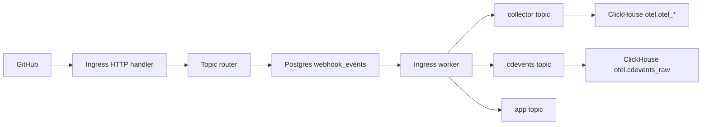
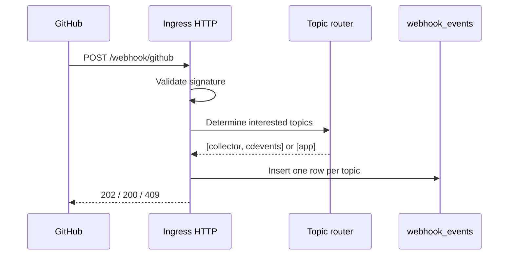
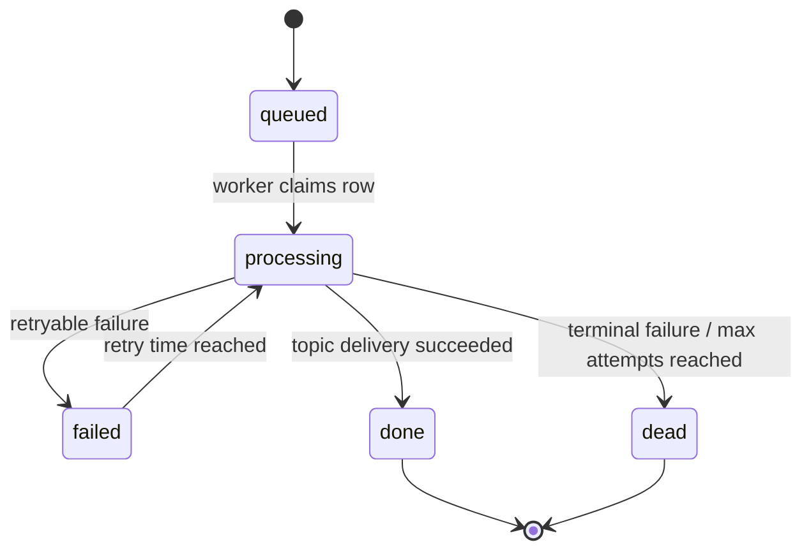
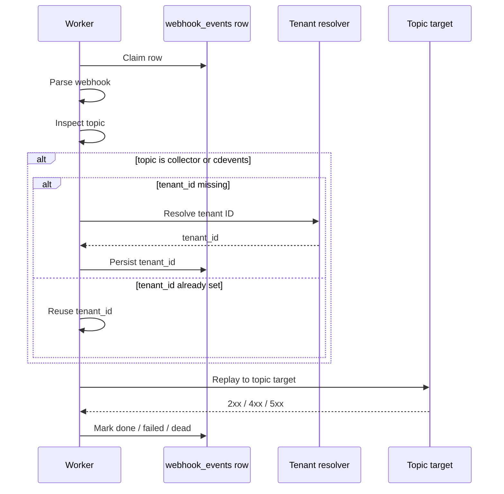
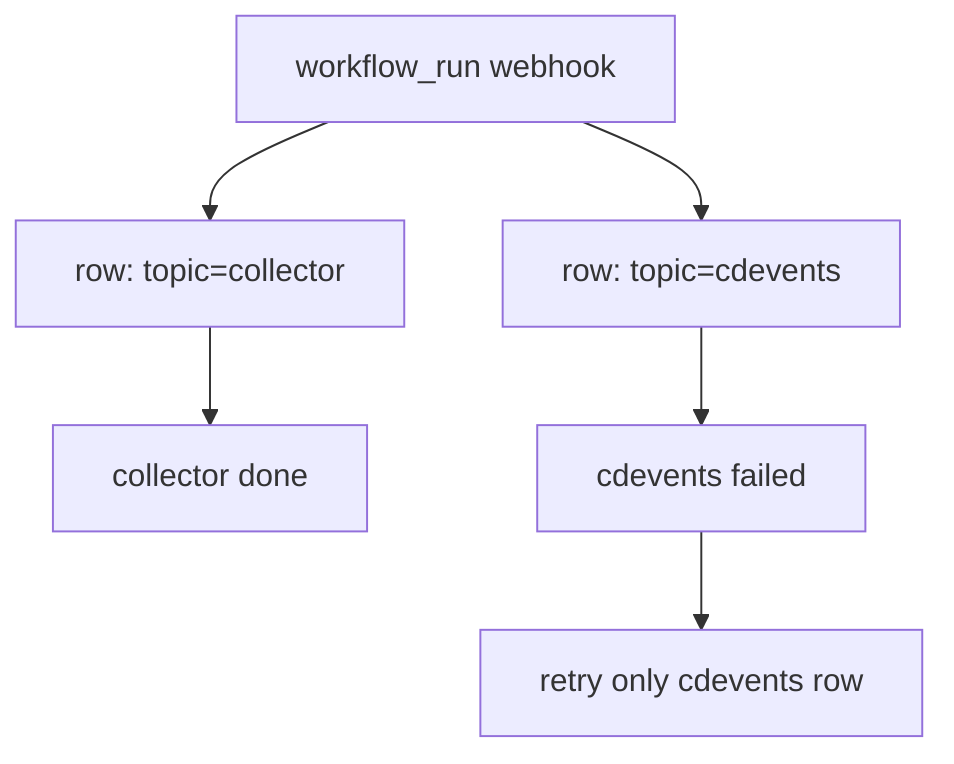

# Webhook Request Lifecycle

This document describes the intended lifecycle of a GitHub webhook when `webhook_events` is topic-based.

The key model is:
- one row per `(source, event_id, topic)`
- `topic` identifies the interested downstream service
- retries are isolated because each service has its own row

Current topics:
- `collector`
- `cdevents`
- `app`

## High-Level Flow

## 1. Request Arrival

Ingress accepts the GitHub webhook and determines which services are interested.

Examples:
- `workflow_run` -> `collector`, `cdevents`
- `workflow_job` -> `collector`, `cdevents`
- `installation` -> `app`
- `installation_repositories` -> `app`

For each interested topic, ingress inserts one row into `webhook_events`.

### HTTP Acceptance Sequence

## 2. Queue Row Model

Each row in `webhook_events` now means:
- one GitHub delivery
- one destination topic
- one retry lifecycle

Suggested important fields:
- `source`
- `event_id`
- `topic`
- `body_sha256`
- `headers`
- `body`
- `tenant_id`
- `status`
- `attempts`
- `next_attempt_at`
- `locked_until`
- `last_error`
- `error_class`

Suggested uniqueness:
- `(source, event_id, topic)`

## 3. Queue State Machine

## 4. Topic-Based Worker Processing

The worker claims rows from `webhook_events` and dispatches based on `topic`.

### Topic: `collector`
- parse webhook
- resolve tenant if needed
- persist `tenant_id` on the row
- replay to collector

### Topic: `cdevents`
- parse webhook
- resolve tenant if needed
- persist `tenant_id` on the row
- replay to cdevents

### Topic: `app`
- parse webhook
- forward installation event to app
- no tenant resolution required

### Processing Sequence

## 5. Isolation Semantics

Isolation comes from separate rows, not from special retry logic.

If a `workflow_run` webhook fans out to:
- `(evt_123, collector)`
- `(evt_123, cdevents)`

then:
- collector can succeed while cdevents fails
- cdevents can succeed while collector fails
- retrying one does not re-drive the other

### Example

## 6. Tenant Resolution

Tenant resolution is topic-specific:

### `collector`
- required
- store `tenant_id` on the row after the first successful resolution
- reuse it on retry

### `cdevents`
- required
- store `tenant_id` on the row after the first successful resolution
- reuse it on retry

### `app`
- not required

This avoids repeated resolution for the same topic row.

## 7. Replay Semantics

For `collector` and `cdevents`:
- clone stored GitHub headers
- strip hop-by-hop headers
- preserve original body
- inject `X-Everr-Tenant-Id`

For `app`:
- forward original installation webhook
- no tenant header required

Status classification:
- `2xx`: success
- retryable: `408`, `429`, `5xx`
- terminal: other `4xx`

## 8. CDEvents Service

The cdevents service receives rows with `topic = cdevents`.

It:
- requires `X-GitHub-Event`
- requires `X-GitHub-Delivery`
- requires `X-Everr-Tenant-Id`
- parses the payload
- maps supported events to CDEvents
- writes normalized rows to ClickHouse

Supported mappings:
- `workflow_run.requested` -> `pipelineRun.queued`
- `workflow_run.in_progress` -> `pipelineRun.started`
- `workflow_run.completed` -> `pipelineRun.finished`
- `workflow_job.in_progress` -> `taskRun.started`
- `workflow_job.completed` -> `taskRun.finished`

## 9. End-To-End Outcomes

### Workflow run webhook
- ingress inserts:
  - one `collector` row
  - one `cdevents` row
- each row is retried independently

### Installation webhook
- ingress inserts:
  - one `app` row
- app forwarding is retried independently

### Partial success
- collector row can be `done`
- cdevents row can be `failed`
- no duplicate collector replay is needed for cdevents retry

## 10. Design Intent

This topic-based model deliberately keeps:
- one queue table
- one row per interested service
- isolated retry state per service

It avoids both:
- a shared multi-target row
- a separate `webhook_deliveries` table
