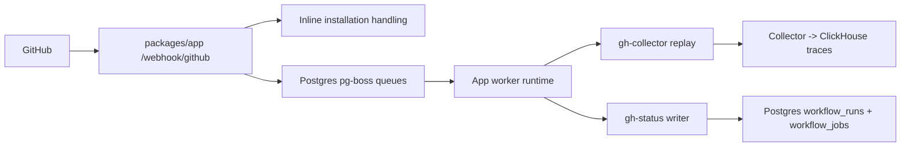

# GitHub Webhook Request Lifecycle

This document describes the current webhook flow in `packages/app`.

## Overview

- GitHub delivers webhooks directly to the app at `/webhook/github`.
- The app validates the GitHub signature once.
- `installation` and `installation_repositories` are handled inline inside the app.
- `workflow_run` and `workflow_job` are fanned out into two durable Postgres jobs:
  - `gh-collector`
  - `gh-status`
- A background `pg-boss` runtime started by the app processes those jobs independently.
- `gh-status` writes normalized workflow state into Postgres `workflow_runs` and `workflow_jobs`.

## Request Handling

### 1. Receive and authenticate

- Only `POST /webhook/github` is accepted.
- The app requires:
  - `X-Hub-Signature-256`
  - `X-GitHub-Delivery`
  - `X-GitHub-Event`
- The request body is verified with `GITHUB_APP_WEBHOOK_SECRET`.

Responses:

- `401` for missing or invalid signature
- `400` for missing required GitHub headers

### 2. Inline installation events

These events are not queued:

- `installation`
- `installation_repositories`

They update app state directly because they only touch the app database and gain nothing from topic isolation.

### 3. Queue workflow events

These events are fanned out into durable queue rows:

- `workflow_run`
- `workflow_job`

For each accepted delivery, the app enqueues one job per queue in `pg-boss`.

Deduplication rules:

- first insert: `202`
- duplicate delivery id for the same queue: `200`

## Queue Processing

The runtime is started only after app migrations complete.

- runtime bootstrap happens from `packages/app/src/server.ts`
- `packages/app/src/server/github-events/runtime.ts` owns the singleton startup guard
- job retries are managed by `pg-boss`

Retries are isolated by queue. A collector failure does not re-run status persistence, and a status failure does not replay collector ingestion again.

## Topic Behavior

### `gh-collector`

- resolve tenant id in-process from the GitHub installation mapping
- replay the original webhook to `INGRESS_COLLECTOR_URL`
- finish only the collector job

### `gh-status`

- resolve tenant id in-process
- normalize supported GitHub workflow payloads into workflow run and job rows
- upsert into `workflow_runs` and `workflow_jobs`
- finish only the status job

## Data Ownership

### Postgres

- the app owns `workflow_runs` and `workflow_jobs`
- the app runtime and CLI watch/tray/notifier flows read workflow state from Postgres

### ClickHouse

- the collector continues to own trace ingestion into ClickHouse
- failure detection and step-level log lookup still come from traces

## Operational Notes

- local Docker Compose keeps only `clickhouse`, `postgres`, and `collector`
- the app process must be running for webhook polling to happen
- GitHub should point to the app tunnel URL on port `5173`
