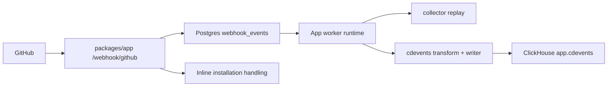

# GitHub Webhook Request Lifecycle

This document describes the current webhook flow after the ingress and cdevents migration into `packages/app`.

## Overview

- GitHub delivers webhooks directly to the app at `/webhook/github`.
- The app validates the GitHub signature once.
- `installation` and `installation_repositories` are handled inline inside the app.
- `workflow_run` and `workflow_job` are enqueued into Postgres once per topic:
  - `collector`
  - `cdevents`
- A background runtime started by the app polls `webhook_events` and processes each topic independently.
- CDEvents are written directly to `app.cdevents`.

## Request Handling

### 1. Receive and authenticate

- Only `POST /webhook/github` is accepted.
- The app requires:
  - `X-Hub-Signature-256`
  - `X-GitHub-Delivery`
  - `X-GitHub-Event`
- The request body is verified with `GITHUB_APP_WEBHOOK_SECRET`.

Responses:

- `401` for missing or invalid signature
- `400` for missing required GitHub headers

### 2. Inline installation events

These events are not queued:

- `installation`
- `installation_repositories`

They update app state directly because they only touch the app database and gain nothing from topic isolation.

### 3. Queue workflow events

These events are fanned out into durable queue rows:

- `workflow_run`
- `workflow_job`

For each accepted delivery, the app inserts one row per topic into `webhook_events`.

Deduplication rules:

- first insert: `202`
- duplicate same body hash: `200`
- duplicate delivery id with different body hash: `409`

## Queue Processing

The runtime is started only after app migrations complete.

- runtime bootstrap happens from `packages/app/src/server.ts`
- `packages/app/src/start.ts` owns the SSR-safe singleton guard
- multi-process coordination relies on Postgres row locking with `FOR UPDATE SKIP LOCKED`

Each queue row has its own lifecycle:

- `queued`
- `processing`
- `failed`
- `done`
- `dead`

Retries are isolated by topic. A collector failure does not re-run cdevents, and a cdevents failure does not replay collector again.

## Topic Behavior

### `collector`

- resolve tenant id in-process from the GitHub installation mapping
- replay the original webhook to `INGRESS_COLLECTOR_URL`
- finalize only the `collector` row

### `cdevents`

- resolve tenant id in-process
- transform supported GitHub workflow payloads into cdevents rows
- buffer and batch writes
- insert directly into `app.cdevents`
- finalize only the `cdevents` row

There is no exposed `/api/internal/github/cdevents` route in the final design. The worker invokes shared server logic in-process.

## Data Ownership

### Postgres

`webhook_events` is now owned by the app migration set under `packages/app/drizzle/`.

### ClickHouse

`app.cdevents` is the only persisted cdevents table.

There is no:

- `otel.cdevents_raw`
- `app.cdevents_mv`
- `otel -> app` materialized-view bridge

## Operational Notes

- local Docker Compose keeps only `clickhouse`, `postgres`, and `collector`
- the app process must be running for webhook polling to happen
- GitHub should point to the app tunnel URL on port `5173`, not the removed ingress service
