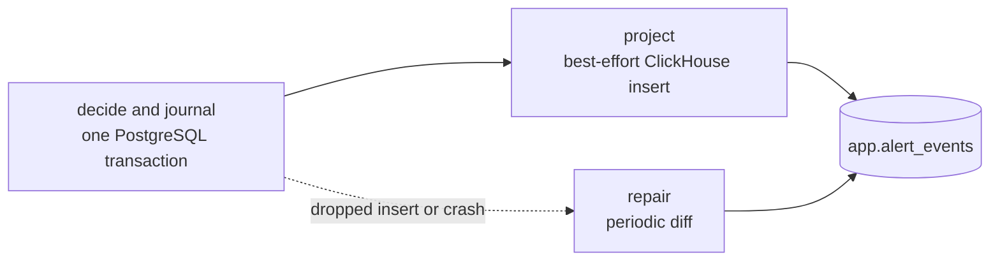
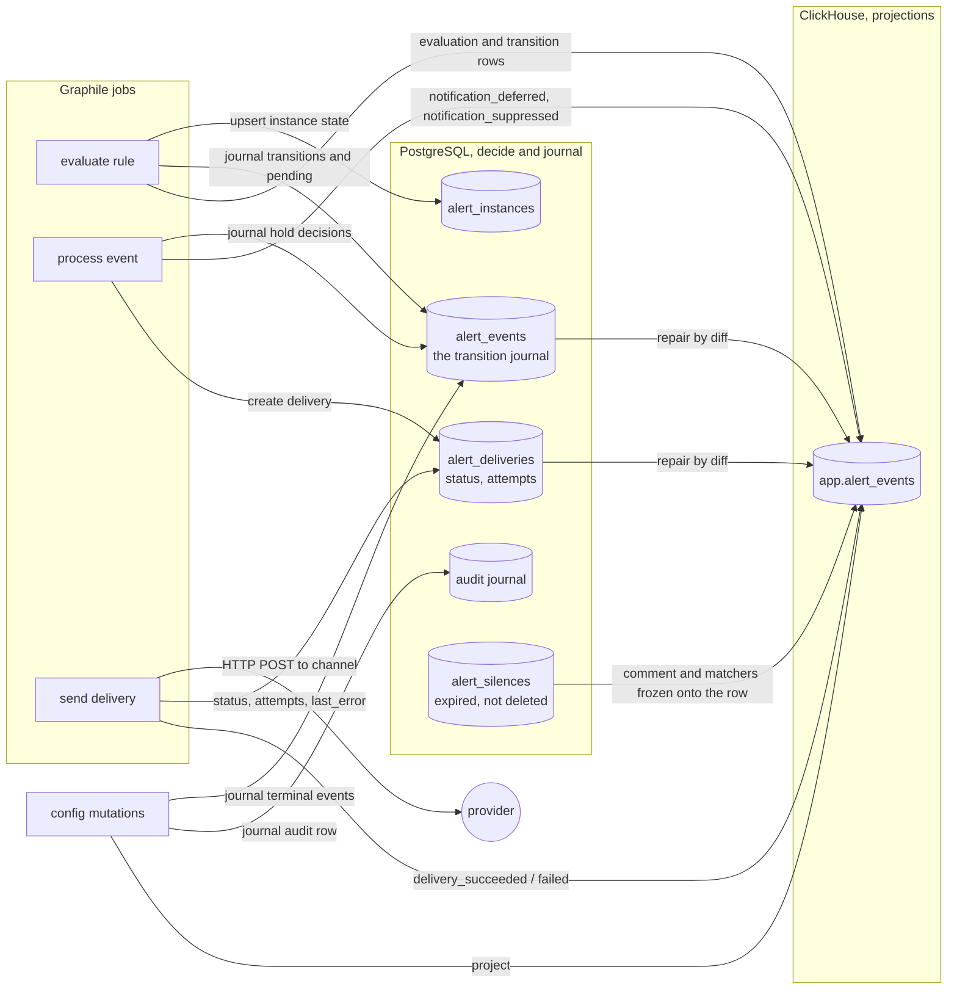
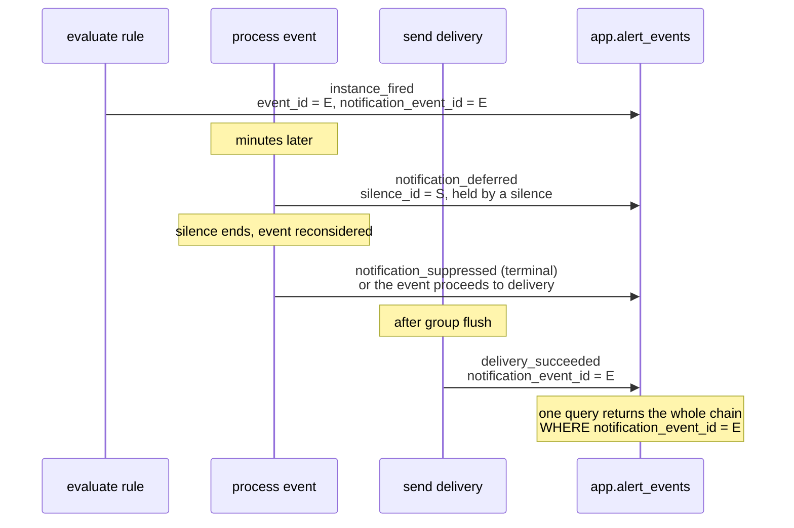

# Alerting investigation surface in ClickHouse

This document describes how alerting becomes queryable through
`everr cloud query`. All sections up to Reference describe the end state. The
gap section, near the end, lists the distance between that and the code today.

This document is not an ADR. It supersedes one assumption of
[ADR 0004](../../../docs/adr/0004-run-alerting-on-graphile-worker.md). It becomes an ADR
when the open questions close.

## Summary

Alerting history lives in one typed ClickHouse table. `app.alert_events`
records what the engine did. With it, `everr cloud query` answers what fired
and what was delivered, without a join to PostgreSQL. Who changed the
configuration is journaled and answered in PostgreSQL; see Auditability
stays in PostgreSQL. PostgreSQL also keeps the state machine, scheduling,
configuration and in-flight delivery coordination.

Each row is an append-only event with an `event_type` discriminator. Rows from
one notification share a `notification_event_id`, because suppression and
delivery happen in later jobs and ClickHouse rows cannot be updated. Current
state is a view over those rows, not a second copy of live state.

Writes obey one rule. Each row that must not be lost starts as a PostgreSQL
journal row. That row commits in the same transaction as the decision it
records. ClickHouse holds best-effort projections of the journal. A periodic
reconciler repairs the projections by diff. Evaluation success rows and
preview terminal rows are the declared exceptions: ephemeral, fire and
forget. Evaluation failures are journaled, so a broken rule is never
invisible.

No secrets are written, and no column is designed to carry personal data.
Every reference to a person is an opaque id. One conditional remains:
labels come from user-authored SQL, and the redaction boundary that
enforces this for them is still open; see Constraints.

## Design premise

Everr exposes observability as SQL. Callers read tables directly through
`everr cloud query`, not through fixed screens. Alerting is not exempt.

There are two kinds of caller. The second sets the requirements:

- **A person writing SQL by hand.** They iterate. An empty result makes them
  add a cast and run again. Friction costs time.
- **An agent writing SQL without feedback.** It sends one query per tool call
  and returns the result with no chance to correct course. It has one
  endpoint, so it cannot also query PostgreSQL. It reads the schema from a
  skill file, so schema size is a budget.

Most constraints below follow from the second caller.

## Scope

Four questions, in priority order:

1. **Alert state.** What fires now, since when, at what value.
2. **State transitions.** How an alert behaved over time, and the value at
   each transition.
3. **Delivery trails.** Whether a notification was delivered, when, and
   whether it succeeded.
4. **Auditability.** Who changed what, when, and what it was before.
   Answered from the PostgreSQL audit journal through the application, never
   from ClickHouse; see Auditability stays in PostgreSQL.

ClickHouse is not the system of record. PostgreSQL stays authoritative for the
state machine, scheduling, configuration, and in-flight delivery coordination.
The application UI may read PostgreSQL directly.

Duplication between the two stores is acceptable. Gaps are acceptable, except
where a missing row reads as a negative answer; see Durability.

## How it works

### The write choreography

One invariant governs every writer: a row that must not be lost starts as a
PostgreSQL journal row, committed in the same transaction as the decision it
records. ClickHouse holds projections of the journal. A stream is either
journaled or declared ephemeral in the Durability table. There is no third
category. A new event type must answer one question before it exists: may this
row be lost?

Every durable write path runs the same three verbs, in order:

- **Decide and journal.** The state change and its journal row commit
  atomically in PostgreSQL. This is the only write that must succeed. If it
  did not commit, the event did not happen.
- **Project.** After commit, a best-effort insert builds the ClickHouse row
  from the journal row plus enrichment in hand, such as evidence. A failure is
  a logged counter, never a retry loop. It never fails the operation that
  produced the event.
- **Repair.** One reconciler runs a diff per journaled stream: ids in
  PostgreSQL for a recent window, minus ids in ClickHouse, inserted with
  `write_source = 'reconciled'`. See Reconciliation.



### Write path

Three jobs write, at three different times. Each runs the choreography above:
authoritative state and journal to PostgreSQL, projection to ClickHouse. Two
writers sit outside the jobs: the configuration mutation sites, which journal
audit rows and close the instances their mutation would orphan, and the
reconciler.



### The transition journal

PostgreSQL `alert_events` started as the in-flight notification work item. The
invariant promotes it to the journal of everything that happened to an
instance. That takes two changes.

First, a `kind` discriminator separates notifying events from state-only ones.
Fired and resolved-from-condition rows enter the delivery pipeline as today.
Pending, pending-cleared and the lifecycle terminals (`rule_paused`,
`rule_deleted`) are born processed: they exist only to be projected. The
`preview_deleted` terminal never enters the journal at all; it is ephemeral,
per Durability. The pipeline must skip them, and the skip is structural, not a
convention: the delivery pipeline reads work through one function that
hard-codes `kind = 'notifying'`, and nothing else queries the journal for
deliverable events. This is the same pattern as the audit enforcement boundary
under Order of work. It makes "deleting a rule pages nobody" a guarantee.

Second, hold decisions stop mutating the work item. Today, processing freezes
`silenced`, `inhibited` and `silence_id` onto the event row, then clears them
before dispatch. That destroys the only durable copy of the hold. Instead,
each change to that triple journals its own decision row that references the
event. The journal type for those rows is `hold_changed` (state kind, born
processed); at projection time one `hold_changed` row becomes a
`notification_deferred` or `notification_suppressed` ClickHouse row,
depending on the decision it records. Queue state and decision history stop sharing columns. The deferral
record becomes repairable. The freeze-then-clear sequence disappears. The
frozen comment and matchers on the ClickHouse row are written at projection
time. A repaired row recovers them with a join to `alert_silences`, which
works because silences expire instead of deleting.

### The notification chain

ClickHouse rows cannot be updated, and the facts about one notification arrive
from three jobs, minutes or hours apart. `notification_event_id` links them:
the transition sets it to its own `event_id`, and every later row carries the
same value.



The application read does the same in two queries: transitions first, then the
outcome rows for those ids, folded onto their transitions. Neither query
touches PostgreSQL.

### Episodes and chain membership

`notification_event_id` links one notification's rows. It cannot link a
resolve to its fire: a resolve is itself a notifying event, so it starts
its own chain. `episode_id` does that job (decided 2026-08-09). It is
minted when an instance leaves inactive: the `instance_pending` row's own
id, or the `instance_fired` row's id when there is no pending phase. Every
lifecycle row of that episode carries it: pending, fired, resolved,
closed. Incident duration is then one `GROUP BY episode_id`; see Worked
queries. The journal carries the episode id, so a repaired row recovers
it.

Membership is fixed per event type:

| Row | `notification_event_id` | `episode_id` |
|---|---|---|
| `instance_pending`, `instance_closed` | zero (they never notify) | the episode |
| `instance_fired`, `instance_resolved` | its own `event_id` | the episode |
| `notification_deferred`, `notification_suppressed`, delivery rows | the transition's id | zero (the chain reaches the episode through its transition) |
| evaluation rows | zero | zero |

## Storage split

ClickHouse holds records of events. PostgreSQL holds current state.

Every ClickHouse row is an append-only event. There is no mutable replica of
live state. A replica could miss one `instance_resolved` and report an alert
as firing forever, with no mechanism to correct it.

This excludes a state replica, not the `ReplacingMergeTree` engine.
`ReplacingMergeTree` for idempotent append stays available; see Rejected
alternatives.

Current state is a view over the transition rows, not a table. A view cannot
diverge from history. It lags PostgreSQL only by the write delay. It can
answer "what was firing at 03:00 on a given date", which a live replica
cannot.

A dropped transition row does not stay missing: the reconciliation diff
writes it back from PostgreSQL. The difference from a replica: the fault is
visible in the rows, and a mechanism repairs it.

State is derived from transitions, so transitions are built first regardless
of priority order.

Point reads are in scope. Retrieving every row for one notification is the
highest-value query on this surface. The relevant distinction is immutable
events versus current state, not aggregate versus point lookup. The sort key
does not serve that query directly; see the sort key limitation in Reference.

### What PostgreSQL owes the history

The history references PostgreSQL rows by id. A row deleted there strands
whatever points at it, and ClickHouse cannot be repaired by a rewrite.

Cancelling a silence therefore closes its window instead of deleting it.
`expireSilence` sets `ends_at` to now and stamps `canceled_at`. The active
lookup is a window test, `starts_at <= now < ends_at`, so a closed window
stops matching everywhere with no query change. Cancelling a silence that has
not started collapses it to zero length rather than inverting it. That is why
the window check permits `ends_at = starts_at` while creation still rejects an
empty window.

`canceled_at` separates a decision from an expiry. Both leave a closed window,
but only one is a person's action, and that is what an investigator looks for.
It also classifies the row in the UI: a cancelled silence that never started
still has future dates, so the dates alone would show it as scheduled.

Deletion belongs to `cleanupAlertingHistory`. It removes silences whose
`ends_at` passed the history retention. An active silence is never a
candidate, because the cutoff is 90 days in the past.

The same rule applies to everything the history references by id. The freeze
under Held notifications reduces the exposure but does not remove it: only
rows written while the silence was live carry the frozen copy.

Preview deletion is the one declared exception. It cascade-deletes the
preview's rows, including its journal rows in `alert_events`, and the
ClickHouse history keeps referencing the dead `preview_id` until TTL. That
is acceptable only because the preview streams are declared ephemeral at
that boundary; see Durability. No live stream may take this path.

## Why a typed table and not app.logs

Alerting facts get a dedicated table. Reuse of `app.logs` would avoid a new
schema, new grants, a separate retention setting, and would reuse the logs
explorer UI. Rejected for four reasons:

- **The schema is known.** Logs exist for unpredictable schemas. In `app.logs`
  every field becomes a map lookup: `LogAttributes['alert.severity']`,
  `row_count` as a String that needs a cast, `delivery_targets` flattened to a
  JSON string.
- **The queries are analytical.** Value comparisons, aggregation by channel,
  time series of transitions. Logs are optimised for text retrieval.
- **Cardinality.** Alert events are low volume next to application logs. A
  merge makes every alerting query scan the larger table. A dedicated table
  gets partition pruning and a sort key tuned for the alerting read.
- **Engine choice.** One table means one engine. Engine choice is a live
  design lever here. Inside `app.logs` it is unavailable.

Accepted cost: a separate table needs its own grants, row policy, TTL,
migration and reference documentation.

### Single table, multiple event types

All rows live in `app.alert_events`, discriminated by `event_type`. One table
lets a reader see a whole incident in timestamp order without a join.

Rows from one notification correlate on `notification_event_id`. A transition
sets it to its own `event_id`. Suppression and delivery rows reference that
value. Evaluation rows leave it zero.

| `event_type` | Written by |
|---|---|
| `evaluation_succeeded` | `evaluation/rule.ts` |
| `evaluation_failed` | `evaluation/rule.ts` |
| `instance_pending` | `evaluation/rule.ts` |
| `instance_fired` | `evaluation/rule.ts` |
| `instance_resolved` | `evaluation/rule.ts` |
| `notification_deferred` | `delivery/suppression.ts` |
| `notification_suppressed` | `delivery/suppression.ts` |
| `delivery_succeeded` | `delivery/history.ts` |
| `delivery_failed` | `delivery/history.ts` |
| `instance_closed` | `evaluation/rule.ts` (pending cleared); the config mutation sites (pause, delete, preview delete) |

Audit events reach no ClickHouse table; see Auditability stays in
PostgreSQL.

`silenced`, `inhibited` and `silence_id` are frozen at write time. They are
computed once during processing and never rewritten. A silence created later
does not change the record of what happened.

Freezing is settled (2026-08-09): a bug in the silencing logic stays wrong
in old rows forever, and that is accepted. The table records what the
engine decided, not what it should have decided; a wrong decision is
itself the fact an investigator needs. Repair re-derives from the journal,
the decision record, never by re-running the logic.

**Those three carry meaning only on `notification_deferred` and
`notification_suppressed` rows.** The evaluation job writes the transition.
The silence check runs later, in the processing job. So `silenced` is always
false on an `instance_fired` row, and
`WHERE event_type = 'instance_fired' AND silenced` returns nothing, however
many alerts were silenced. The Reference table repeats this next to the
columns, because a reader who misses it gets a confident empty result, not an
error.

`rule_muted` is unrelated to silencing. It is a property of the rule: true
when the rule sets `spec.suppressed` or belongs to a preview. It is set on
every row, including evaluations. It means the rule never notifies at all.
`silenced` means one notification was withheld. The column does not reuse the
spec field's name on purpose: `suppressed` sits one word away from
`notification_suppressed` with an unrelated meaning, and a reader with one
query to spend must not face that collision.

`delivery_targets Map(String, Array(String))` maps channel type to channel
name, not to an address. See Constraints.

#### Held notifications

A silence or an inhibition does not always end a notification. If the
instance still fires, processing defers the event and reconsiders it later:
at the silence's end for a silence, on a 60-second poll for an inhibition.
The notification then goes out late.

`notification_deferred` records each hold. Without it, the chain shows a fire
at 02:00 and a delivery at 06:00, with nothing to explain the four hours. The
hold starts as a journal decision row (see The transition journal), so a
dropped projection is repairable.

Write the row on a change to the `(silenced, inhibited, silence_id)` triple,
not on every deferral. The inhibition path re-defers every 60 seconds, so a
row per deferral would be 60 rows an hour for one held notification. One row
per hold period, plus one more if a silence lapses into an inhibition, is the
useful resolution.

The delivery row does not carry the hold. `silenced` means the notification
was withheld. On a `delivery_succeeded` row it would assert both sent and not
sent, and the column's meaning would change with `event_type`. A separate row
keeps one meaning per column, records when the hold started, and makes "what
is held right now" answerable: a deferral with no later delivery or
suppression.

`notification_suppressed` stays reserved for the terminal decision: this
event will never be delivered. A deferred event may still be delivered, so a
"withheld" claim at defer time could turn false. `notification_deferred`
claims only that the notification was held at that moment, which stays true.

A hold always closes. A deferred event whose condition clears, or whose
rule is paused or deleted, gets its own terminal `notification_suppressed`
row with a matching `reason`. "What is held right now" is therefore a
bounded read: a deferral with no later delivery or suppression.

#### Resolving a silence id

Suppression and deferral rows freeze the silence's comment and matchers next
to `silence_id`.

The id alone is a dead end for `cloud query`. Silences live in PostgreSQL,
and a caller with one SQL endpoint cannot turn the UUID into anything
readable. That breaks the self-sufficiency constraint. The two frozen fields
make the row legible on its own (`silenced by "deploy window"`) and keep it
correct after the silence is edited or removed.

The two frozen fields are the fix, not a stopgap. Audit stays in
PostgreSQL, so no ClickHouse join will ever resolve the id. The freeze
answers the common question on the row itself, and stays correct after the
silence is edited or removed.

#### The stream closes its own instances

Every event that opens something has a terminal counterpart. The
non-notifying terminal is `instance_closed` (decided 2026-08-09): born
processed, discriminated by `reason`: `pending_cleared`, `rule_paused`,
`rule_deleted`, `preview_deleted`. A recovery stays `instance_resolved`,
the notifying transition, and carries `reason = 'condition_cleared'`. The
split keeps the history UI honest: "stopped because someone deleted the
rule" never renders as "resolved".

Two holes force this. First, a pending instance whose condition clears before
it fires emits nothing today. Once `instance_pending` rows exist, each would
be ambiguous: still pending, or long recovered. Second, rule mutations strand
instances. Pause freezes instances as `firing` in PostgreSQL indefinitely.
Delete cascade-deletes them. Neither writes to ClickHouse. After the
mutation, no store remembers the instance was open, so nothing can close the
history later. The state view would report a deleted rule's alert as firing
forever. A ClickHouse-only caller cannot learn otherwise: rule liveness is
scheduler state, and the self-sufficiency constraint forbids the join.

The fix: the mutation closes its instances in its own transaction. Pause and
delete journal one terminal event per open instance, with the reason, before
the cascade or reset that would forget them. The rows are born processed, so
nobody is paged "resolved" because a colleague deleted a rule. A crash after
commit loses only the projection, which the reconciler rebuilds from the
journal.

Preview deletion writes its terminal rows as projections only, and is
declared ephemeral in the Durability table. Journaling them would be
theater: the journal row carries the `preview_id`, so the preview delete
cascade removes it in the same transaction, and nothing would remain to
repair from. The declaration states the real guarantee instead of implying a
false one. The accepted loss is bounded on every side: preview rules never
notify, the state view folds live rows only, and a reader of raw preview
transitions is inside the preview context, where a missing terminal reads as
a gap, not as a recovery.

Pause also resets its instances to `inactive` in the same transaction. If
PostgreSQL kept the instance as firing while the history closed, resume would
be incoherent: the state machine sees present-and-firing, emits nothing, and
a still-broken alert stays resolved in history and never notifies again. The
reset makes resume start from scratch: re-pending, re-firing, re-notifying.
That is also the correct paging behavior for "we paused it for a week and it
is still broken".

Pause also cancels the delivery side, in the same transaction (decided
2026-08-09): the rule's unprocessed and deferred events are marked terminal
with a `notification_suppressed` row carrying `reason = 'rule_paused'`,
which also closes their held chains, and group flush re-checks rule
liveness at claim time, and the send job re-checks it once more before the
provider call. Nothing sends after a pause. A chain that already notified is
not suppressed retroactively: the terminal `notification_suppressed` marks
only chains that never notified. The same shape covers delete with its own
reason.

The state view stays a pure fold over transitions and never needs rule
liveness. The investigator also gets a useful fact: "stopped because someone
deleted the rule" is a different story from "recovered".

## Durability

Fire-and-forget is acceptable where a missing row reads as a gap. It is not
acceptable where a missing row reads as a negative answer acted on during an
incident.

| Stream | Write pattern | Reason |
|---|---|---|
| Evaluation successes | Ephemeral: project only, fire and forget | A gap is a gap; nothing reads an absent success row as a claim |
| Evaluation failures | Journaled: decide and journal, project, repair | Staleness and broken-rule claims read from them; a dropped insert must not read as healthy. Failures are the low-volume exception path, so the 2.2M success rows stay fire and forget |
| Preview terminal rows | Ephemeral: project only, fire and forget | The preview delete cascade removes the journal that would repair them; see The stream closes its own instances |
| Everything else: transitions, pending, hold decisions, deliveries | Journaled: decide and journal, project, repair | A missing row reads as a negative answer acted on during an incident |

Stream-by-stream classification would let each new stream escape the
durability umbrella until someone noticed, and the first symptom is the worst
one: a dropped `instance_fired` makes "what fired in the last hour" return
nothing. The classification table is the structural fix; the classification
question is asked once, when an event type is born.

Preview streams sit between the ephemeral and journaled rows. While a
preview lives, its rows are journaled and repaired like live rows, with no
carve-out anywhere. Deleting the preview cascade-deletes its journal in
PostgreSQL, which ends repair and is why the preview terminal rows are born
ephemeral. The guarantee matches the artifact: preview rules never notify,
preview history is developer feedback with no incident reader, and the state
view folds live rows only, so no surface turns an absent preview row into a
confident wrong answer.

Deliveries bend the first verb without breaking it. No transaction can span
the provider call, so the journal row reaches terminal status after the
effect. That status update is the decision the projection and the repair
follow. See Rejected alternatives.

Delivery itself is at-least-once, documented rather than closed (decided
2026-08-09): a crash between provider acceptance and the status update
pages twice while the trail shows one delivery. The trail counts recorded
outcomes, not provider calls. Per-recipient fan-out state for email and
Telegram keeps a partial success from re-sending succeeded recipients;
provider idempotency is used where it exists.

Audit sits outside this table entirely. The audit row commits with the
mutation in PostgreSQL and is read there. No projection, no repair stream;
see Auditability stays in PostgreSQL.

### Reconciliation

Every journaled stream has a durable PostgreSQL record to diff against.
`alert_events` holds one row per transition, pending change and lifecycle
terminal, under the same id ClickHouse stores as `event_id`, and its decision
rows cover holds. `alert_deliveries` with the `alert_delivery_events` join
table covers deliveries.

Each cycle, one job runs a diff per stream. It queries ClickHouse for the
ids in the window, queries PostgreSQL for what reached terminal status in
the same window, and inserts the difference. A journal row deleted
mid-window, as the preview cascade does, only shrinks the PostgreSQL side,
so a deletion can never cause an insert. Transitions and evaluation
failures diff on `event_id`. Deliveries diff on outcome, per
`(delivery_dedup_key, notification event)` pair: the delivery row's own id
is deterministic, derived from the journal event and the delivery key, and
a `delivery_succeeded` row is repaired whenever the PostgreSQL status is
sent and no succeeded row exists for the pair. Presence alone cannot detect
a lost success: an attempt's `delivery_failed` row can land while the final
success insert drops, which would leave the delivery permanently recorded
as failed. That is why the ClickHouse row carries `delivery_dedup_key`:
`alert_deliveries` has no id column of its own, and without the key, one
event fanned out to three channels leaves the diff unable to tell which
channel's row is missing. Each diff is one partition-pruned aggregation per
cycle, and the partition dimension keeps it off the evaluation stream; see
Reference.

A duplicate in an append-only table is permanent and double-counts in every
aggregate. The defense is idempotence, not exclusion. Every history insert,
live and repair alike, carries an `insert_deduplication_token` derived from
the stream and the row id, the table sets
`non_replicated_deduplication_window`, and both writers use the same pinned
synchronous insert mode. An overlapping run, a retried job, and an in-doubt
insert that the server completes after the client gave up then all converge
on one row instead of duplicating. The live path must share the token
scheme: without it, a live insert that flushes late meets its reconciled
copy and the duplicate is permanent. The reconciler still runs as one
Graphile job in a named queue, so runs are serial, but that is scheduling
hygiene, not the correctness mechanism: a serial queue cannot exclude an
expired job lock's revived run or a crashed run's retry.

The diff window is wide, and both of its bounds are invariants under test.
The diff filters on `journaled_at`, a timestamp PostgreSQL stamps on the
journal row, evaluated against the PostgreSQL clock, never the
reconciler's process clock and never the Node-stamped domain time
(`occurred_at` stays the domain time). One honesty note: `now()` is
transaction-start time, not commit time, so a row becomes visible up to
one transaction duration after its stamp; a diff window narrower than the
longest journal-writing transaction (a slow registry apply) would let a
committed row land inside an already-diffed range and never be examined.
The window spans days, not minutes: the journaled streams are small (see
Volume arithmetic), a wide diff stays cheap, and re-diffing
already-repaired ranges is harmless once inserts are idempotent. The
lower bound must exceed any plausible outage plus the maximum delivery
retry span plus the longest journal-writing transaction, or rows are lost
forever while the journal still holds them. The upper bound must stay below min(tenant `logs_days`,
the 90-day journal retention), or the diff resurrects TTL-expired rows
every cycle, forever.

Reconciled rows are marked `write_source = 'reconciled'`, so a reader can
always separate the live stream from repairs. They carry the PostgreSQL timestamp
(`occurred_at` for transitions, `updated_at` for deliveries) as `event_time`,
never the insert time, so duration queries read real event time, not
reconciliation lag.

A repaired row is near full fidelity, not skeletal. The journal carries the
fingerprint, labels, severity and suppression flags. Four degradations are
accepted, all flagged by `write_source`:

- `evidence_json` is empty. The at-transition evidence existed only in the
  evaluator's hands.
- `evaluation_scheduled_at` is approximated by `occurred_at`.
- `service_name` falls back down its resolution order when the rule was
  deleted in between.
- `delivery_targets` is rebuilt from the current channel config, decrypted at
  repair time. A channel renamed since the send gets today's name on an old
  row. `unknown` is recorded when decryption fails, as on the live path.

The reconciler is itself a failure mode. A reconciler bug is the most likely
way this table acquires wrong rows. Its repairs are counted next to the
dropped-insert counters. A rising repair rate means the primary path rots.
Repairs for rows that were never dropped mean the diff window is wrong.

One dependency must be explicit in the implementation:

- **PostgreSQL must still hold the row.** `cleanupAlertingHistory` in
  `server/alerts/maintenance/cleanup.ts` deletes delivery and event rows at
  `HISTORY_RETENTION_DAYS`, currently 90. Every diff reads those rows. That is
  sufficient for any reasonable cadence, but correctness then depends on a
  constant in an unrelated file. A lower value loses deliveries and
  transitions silently. Add a comment at both ends and a test that fails if
  the window exceeds the retention.

### Rejected alternatives

**A transactional outbox.** The side effect is an HTTP POST to a third party.
No transaction spans "the provider accepted it" and "the row landed". A write
before the call records deliveries that did not happen. A write after loses
ones that did. Reconciling from PostgreSQL state avoids the problem.

**`ReplacingMergeTree` with blind re-insert.** The sort key ends in
`event_id`, so an engine switch would make re-insert idempotent and remove
the need to track what was already written. The engine deduplicates on
merge, not on insert, so every re-drain exposes pre-merge duplicates to
`SELECT *` and `count()` until the merge runs. `ReplacingMergeTree` stays
available if the diff query proves expensive. Diff reconciliation is still
preferred: no engine change, and no pre-merge duplicates.

**A table PROJECTION ordered by `notification_event_id`.** It would serve the
chain point read exactly, at the cost of a second copy of the projected
columns and a tax on every insert. Not taken: the UUIDv7-derived time bound
already prunes that read well through the `toYYYYMM(event_time)` partition
key. It is the escalation if chain reads ever
measure slow, and it needs no recreation: `ALTER TABLE ADD PROJECTION` works
on a live table.

### Insert failures

Writes are best-effort and failures are logged, in `recordAlertHistory` and
`recordDeliveryOutcome`. History recording must never fail the operation that
produced it. Two consequences:

- **Failures are logged but not counted.** Nothing tracks how often an insert
  is dropped. A counter or span event on `alerts.history.insert_failed` and
  `alerts.history.delivery_outcome_failed` closes that.
- **A history writer that performs I/O must be non-throwing by construction.**
  `recordDeliveryOutcome` reads PostgreSQL to find the events a delivery
  covered. An exception that escapes it on the send path would mark a
  delivered notification as failed and cause a second delivery. Any future
  writer on a delivery or evaluation path inherits this requirement.

## Constraints

**Nothing irreversible.** ClickHouse is append-only with a TTL. A secret or
personal detail written into it stays for the full retention period.
Best-effort covers losing rows, not writing wrong ones.

- No secrets. Webhook URLs, bot tokens and Telegram chat ids appear in no
  column, including inside a rendered notification body.
- No personal data in `app.alert_events`. Delivery rows carry a channel name
  or an opaque recipient id. The mapping to a person stays in PostgreSQL,
  where erasure is a `DELETE`.
- No personal data anywhere, with one conditional. The audit actor lives in
  the PostgreSQL journal, where erasure is a `DELETE`. No column is designed
  to name a person, so no erasure protocol has to span two stores. The
  conditional is `instance_labels` and the frozen silence matchers: both
  come from user-authored SQL and can contain anything, and the enforcement
  boundary that redacts them is still open (see Remaining redaction rules).
  Until it lands, the erasure claim for labels holds by rule, not by
  mechanism. What lands now (decided 2026-08-09) is a hard length cap per
  label key and value at the write boundary: the cap is mechanical, the
  no-personal-data rule is not.

Settled for delivery targets: `deliveryTargets` in
`server/alerts/delivery/history.ts` records the channel name, not its
address; email rows record no recipient count and no address. Settled for
the rendered notification body (2026-08-09): it never lands in ClickHouse.
It stays in PostgreSQL (`alert_deliveries.notification`), where erasure is
a `DELETE`; the agent-facing content travels as `context_json` instead.
Settled for channel config snapshots in the PostgreSQL audit journal: a
typed redacted-snapshot schema per channel type serializes only non-secret
fields, so a newly added secret field is excluded by default.

**Self-sufficient for `cloud query`.** A caller answering any of the four
questions must not need a join to PostgreSQL: an agent with one endpoint
would return a less complete answer without a signal that it did. Facts a
read would otherwise join for are copied onto the row at write time. The
application, which holds both connections, is not bound by this.

**Typed columns, not attribute maps.** Every fact worth filtering on is its
own typed column. `WHERE severity = 'critical' AND row_count > 0` can be
written correctly without inspecting the data first. The map-lookup form
(see Why a typed table) is reached only after empty results, and an agent
with one attempt returns the empty result as its answer.

**Documentable in a page.** A schema that cannot be described as a column
reference plus worked queries is too large, because roughly a page is what
fits in a skill file. Schema size is a budget. The Reference section is both
the artifact this requires and the test it must keep passing.

## Excluded from ClickHouse

| Excluded | Reason |
|---|---|
| Scheduling internals: next evaluation time, leases, job queue | High churn, no retrospective value |
| Idempotency and dedup keys | Engine bookkeeping |
| In-flight retry state | A live question; query the application |
| Secrets | Append-only store, cannot be removed |
| Names and emails | Ids only; the actor lives in the PostgreSQL audit journal, where erasure is a `DELETE` |
| The audit trail | Journaled and read in PostgreSQL; see Auditability stays in PostgreSQL |
| Current configuration as truth | Rules and channels live in git and PostgreSQL; the audit snapshot is sufficient |
| Local and desktop parity | Alerting does not run locally, so `everr local query` will not see these tables |

## Auditability stays in PostgreSQL

Decided in the 2026-08-09 review. Audit was designed as its own ClickHouse
table, `app.alert_audit`, journaled and repaired like every other stream,
with `actor_display` denormalized onto the row. It is cut, for three reasons
that compound:

- It was the only stream that put personal data into an append-only store.
  Every erasure mechanism that followed from that (mutations on ClickHouse,
  delete plus redacted re-insert, a two-store erasure protocol so the
  reconciler cannot resurrect an erased name) existed only to serve it.
- It duplicated the full per-table cost (grants, row policy, TTL,
  reconciliation stream, reference section) for the lowest-priority scope
  question, at a volume PostgreSQL serves trivially.
- The application, which answers configuration questions today, holds both
  connections and is not bound by the self-sufficiency constraint.

What remains is the part that was always the real work: the audit journal in
PostgreSQL and the actor plumbing that feeds it; see Cost of the audit work
and step 10 in Order of work. The journal is the durable record, so
projecting it into ClickHouse later stays a pure addition if agents ever
demonstrably need "who changed what" through `cloud query`. Until then, that
question belongs to the application, and its absence from ClickHouse is
declared here instead of discovered as a permission error.

## Engine instrumentation

Domain facts belong in typed columns. Engine operations, such as evaluation
latency, ClickHouse query cost and delivery HTTP timing, belong in
OpenTelemetry spans, with the existing `everr.feature` attribute convention.

## Reference

`app.alert_events`. Row policies scope every read to the caller's tenant, so
queries must not add a `tenant_id` predicate.

| Column | Type | Notes |
|---|---|---|
| `event_id` | `UUID` | Unique per row. UUIDv7 on transition, evaluation and hold rows: `UUIDv7ToDateTime(event_id)` recovers its creation time, and the value equals the PostgreSQL journal row it projects (the `alert_events` id on transition rows, the hold decision row's id on `notification_deferred` rows). Delivery rows and terminal `notification_suppressed` rows are the exceptions: their ids are deterministic so a retry or repair converges instead of duplicating, and they carry no embedded time, which nothing needs there, because a chain's time bound derives from `notification_event_id` and both carry `event_time`. Delivery ids hash the journal event and `delivery_dedup_key` (failed attempts additionally hash their attempt time, so each retry keeps its own row while the succeeded id stays stable); suppression ids hash the notification event alone, because a chain gets exactly one terminal suppression |
| `notification_event_id` | `UUID` | Links a transition to the suppression and delivery rows that follow it. Zero on evaluation rows. UUIDv7, so its embedded time is the chain start; see Worked queries |
| `tenant_id` | `LowCardinality(String)` | Enforced by row policy; a `cloud query` caller must never filter on it |
| `alert_definition_id` | `UUID` | Bloom skip index |
| `repoid`, `slug` | `LowCardinality(String)` | Sort key prefix; filtering on both is significantly faster |
| `preview_id` | `UUID` | Zero UUID means live |
| `is_live` | `Bool` | Computed by `DEFAULT` from `preview_id`, so it stays visible to `SELECT *` and filtering to live alerts never types a zero sentinel |
| `event_type` | `LowCardinality(String)` | See the event-type table above. Second partition dimension: evaluation rows sit in their own partitions, so every non-evaluation query skips them whole |
| `write_source` | `LowCardinality(String)` | `'live'` or `'reconciled'` |
| `evaluation_scheduled_at`, `event_time` | `DateTime64(3)` | The partition key's time dimension is `toYYYYMM(event_time)`, so a plain `event_time` bound prunes with no second predicate. `evaluation_scheduled_at` is zero (epoch 1970) off evaluation rows; never `dateDiff` against it there. Delivery `event_time` is send time, not evaluation time |
| `row_count` | `UInt64` | Rows returned by the rule query, which is arbitrary user SQL |
| `evidence_json`, `samples_json` | `String` | Opaque JSON |
| `evidence_truncated`, `samples_truncated` | `Bool` | Set when the JSON beside them was truncated |
| `error` | `String` | Set on `evaluation_failed` and `delivery_failed` |
| `instance_fingerprint` | `String` | Stable identity of one alerting instance |
| `episode_id` | `UUID` | The episode's opening event id (UUIDv7): one continuous breach from leaving inactive to resolved or closed. Set on `instance_pending`, `instance_fired`, `instance_resolved` and `instance_closed`; zero elsewhere. `GROUP BY episode_id` reads an incident whole |
| `context_json` | `String` | Opaque JSON frozen at write time on lifecycle rows, keys `{summary, description, links: {runbook, alert}, condition}`. The condition summary makes "at what value" readable on the row; the links are the agent's pivot to the runbook and the alert detail. The rendered notification body itself never lands in ClickHouse |
| `instance_labels` | `Map(LowCardinality(String), String)` | `labels['service']` works in one shot; keys are low cardinality by construction |
| `service_name` | `LowCardinality(String)` | The service the alert concerns, resolved at write time; `'alert'` when none |
| `severity` | `LowCardinality(String)` | `info`, `warning` or `critical`, validated at the spec boundary, not by the insert path (a non-throwing writer must not drop rows when a value is added). The rule's severity when the row was written; editing a rule changes later rows, not past ones |
| `rule_muted` | `Bool` | The rule never notifies (`spec.suppressed` or a preview). Set on every row; unrelated to `silenced` |
| `reason` | `LowCardinality(String)` | `condition_cleared` on `instance_resolved`; `pending_cleared`, `labels_changed`, `rule_paused`, `rule_deleted` or `preview_deleted` on `instance_closed`; `rule_paused`, `rule_deleted`, `no_longer_firing` or `no_channels` on a terminal `notification_suppressed`. The closed vocabulary is `ALERTING_LIFECYCLE_REASONS` in `data/alerting/vocabulary.ts` |
| `silenced`, `inhibited` | `Bool` | Frozen at write time. Meaningful only on `notification_deferred` and `notification_suppressed` rows; always false on a transition |
| `silence_id` | `UUID` | The matched silence, zero if none |
| `silence_comment`, `silence_matchers_json` | `String` | Frozen from the silence, so the row reads without PostgreSQL |
| `inhibition_comment`, `inhibition_source_json` | `String` | Reserved for inhibitions, mirroring the silence freeze columns; no writer yet, always empty today |
| `delivery_targets` | `Map(String, Array(String))` | Channel type to channel name; never an address |
| `delivery_dedup_key` | `String` | The PostgreSQL delivery key; the reconciliation diff joins on it. Empty off delivery rows |

**Sort key limitation.** `ORDER BY (tenant_id, repoid, slug, event_type,
event_time, event_id)` is tuned for per-alert history, the dominant
application read. Two common queries are not served by it:

- Tenant-wide questions, such as "what fired anywhere in the last hour", skip
  `repoid` and `slug`, so the primary index cannot prune for them. Their time
  bound still prunes partitions and parts through the partition key's time
  dimension, and their `event_type` filter prunes the evaluation partitions;
  see the partition note below.
- Retrieving one notification by `notification_event_id`, the highest-value
  query on this surface, is covered by the partition prune from its derived
  time bound plus a bloom skip index. The bound is therefore not optional;
  see Worked queries.

The second partition dimension carries the load the sort key cannot.
Evaluation rows outnumber everything else by two orders of magnitude (see
Volume arithmetic), and a skip index cannot exclude them: every rule
contributes one row of each event type to its granule range, so the wanted
value is present almost everywhere. Measured in the 2026-08-09 findings, a
`set(32)` index skipped zero granules on this document's own queries.
Splitting the partition key on the evaluation stream keeps every query on
transitions, suppression or deliveries, and every reconciliation diff, off
the evaluation rows entirely.

The partition key is `(toYYYYMM(event_time), event_type IN
('evaluation_succeeded', 'evaluation_failed'))`, not a separate date
column. ClickHouse prunes partitions through a monotonic function of a
filtered column, and it keeps a per-part MinMax index on `event_time`
itself, so the plain `event_time >= ...` bound that every worked query
already carries prunes months and parts with no second predicate, and an
`event_type` filter prunes the evaluation dimension the same way.
Partition count stays about two per month. A date column populated by
DEFAULT would not prune: ClickHouse does not infer the DEFAULT relation
between two columns.

`event_time` stays `DateTime64(3)`, although `DateTime` would halve its index
footprint: the rows of one notification chain can land within a second, and
their order matters.

Retention splits by stream inside one table. Evaluation rows expire at 30
days (really min(30, `logs_days`)), everything else at the tenant
`logs_days`. The split expires the captured samples and the query-wide
evidence, which live only on evaluation rows; the per-instance evidence
that matters historically is written onto the transition rows and lives at
full retention. The partition dimension makes the split cheap: an
evaluation partition is uniformly expirable, so its TTL is an instant
partition drop instead of a TTL merge that rewrites parts. A retention key
separate from `logs_days` is deferred, not rejected: `ALTER TABLE MODIFY
TTL` exists, so retention stays mutable.

`ORDER BY` is immutable in ClickHouse, so a sort key change requires a table
recreation. `app.alert_events` is treated as recreatable here; destructive
migration is accepted in
[`04-alerting-branch-review.md`](04-alerting-branch-review.md).

### Volume arithmetic

Every "fine at current volume" claim above is checkable against this
arithmetic. Inputs, with assumptions labeled:

- Evaluation cadence: 60 seconds, the interval this repo's own rules use.
  One rule writes 1,440 evaluation rows a day.
- Rules per tenant: assume 50.
- Transitions: assume 100 rows a day per tenant across all rules. This is
  deliberately generous; most rules do nothing most days.
- Deliveries, holds and pending rows: assume 3 rows per transition.

Per tenant that is roughly 72,000 evaluation rows a day, capped by the 30-day
TTL at about 2.2 million rows, against roughly 400 non-evaluation rows a day,
or 36,000 over a 90-day retention. Evaluations outnumber everything else by
two orders of magnitude. That justifies the split TTL, the evaluation
partition dimension, and the full-retention fold in `app.alert_state`: the
state view reads the 36,000, not the 2.2 million. At 100 tenants and 10x growth the table
holds low billions of evaluation rows, ordinary for ClickHouse, and every
non-evaluation stream stays small enough to read whole. If measured inputs
move materially (cadence well below 60 seconds as the norm, or transition
volume far above the assumption), revisit the state view window first, then
the evaluation TTL.

### Worked queries

Every query below that selects by predicate filters `is_live`. Preview
rows are visible on this surface by design (decided 2026-08-09), so
live-only is the default posture, stated once: drop the `is_live`
predicate only when the question is about a preview, or on a point lookup
by `notification_event_id`, where the id already pins one chain, live or
preview, and the filter would hide a preview chain asked for by id.

What fired in the last day:

```sql
SELECT event_time, slug, instance_fingerprint, severity, instance_labels,
       notification_event_id
FROM app.alert_events
WHERE event_type = 'instance_fired'
  AND is_live
  AND event_time >= now() - INTERVAL 1 DAY
ORDER BY event_time DESC
LIMIT 100
```

How long each incident ran and how it ended. `episode_id` groups one
continuous breach, so duration needs no self-join:

```sql
SELECT episode_id, any(slug) AS slug,
       min(event_time) AS opened_at,
       dateDiff('minute', min(event_time), max(event_time)) AS duration_minutes,
       argMax(event_type, (event_time, event_id)) AS last_event_type,
       argMax(reason, (event_time, event_id)) AS last_reason
FROM app.alert_events
WHERE event_type IN ('instance_pending', 'instance_fired',
                     'instance_resolved', 'instance_closed')
  AND is_live
  AND event_time >= now() - INTERVAL 7 DAY
GROUP BY episode_id
ORDER BY opened_at DESC
LIMIT 100
```

Every row for one notification. The time bound is not optional:
`notification_event_id` is not in the sort key, so without it the query scans
every partition in the retention range. But the bound is derived, never
guessed. The id is UUIDv7, so `UUIDv7ToDateTime` reads the chain's start time
out of the id, minus a day of slack for clock skew. A hold of any length
cannot truncate the chain, because every later row sits after the bound. The
trailing `event_id` only makes ties stable: chain rows come from different
jobs on different hosts, so read the sequence from `event_type`, never from
id order:

```sql
SELECT event_time, event_type, silenced, inhibited, silence_id,
       delivery_targets, error
FROM app.alert_events
WHERE notification_event_id = toUUID('...')
  AND event_time >= UUIDv7ToDateTime(toUUID('...')) - INTERVAL 1 DAY
ORDER BY event_time, event_id
LIMIT 100
```

Withheld and held notifications for one alert. `silence_comment` is on the
row, so nothing has to resolve the id:

```sql
SELECT event_time, event_type, instance_fingerprint,
       silenced, inhibited, silence_id, silence_comment
FROM app.alert_events
WHERE repoid = '...' AND slug = 'default/high-5xx'
  AND event_type IN ('notification_suppressed', 'notification_deferred')
  AND is_live
  AND event_time >= now() - INTERVAL 7 DAY
ORDER BY event_time DESC
LIMIT 100
```

How long a silence held each notification that went out late. Deliveries
and holds both fan out, so aggregate each side per `notification_event_id`
before the join; this is the join template for this table:

```sql
SELECT held.silence_comment,
       held.held_from,
       sent.delivered_at,
       dateDiff('minute', held.held_from, sent.delivered_at) AS held_minutes
FROM (
    SELECT notification_event_id,
           any(silence_comment) AS silence_comment,
           min(event_time) AS held_from
    FROM app.alert_events
    WHERE event_type = 'notification_deferred'
      AND is_live
      AND event_time >= now() - INTERVAL 7 DAY
    GROUP BY notification_event_id
) AS held
INNER JOIN (
    SELECT notification_event_id,
           max(event_time) AS delivered_at
    FROM app.alert_events
    WHERE event_type = 'delivery_succeeded'
      AND is_live
      AND event_time >= now() - INTERVAL 7 DAY
    GROUP BY notification_event_id
) AS sent USING notification_event_id
ORDER BY held_minutes DESC
LIMIT 100
```

Delivery outcomes by channel type:

```sql
SELECT arrayJoin(mapKeys(delivery_targets)) AS channel_type,
       countIf(event_type = 'delivery_succeeded') AS sent,
       countIf(event_type = 'delivery_failed') AS failed
FROM app.alert_events
WHERE event_type IN ('delivery_succeeded', 'delivery_failed')
  AND is_live
  AND event_time >= now() - INTERVAL 7 DAY
GROUP BY channel_type
LIMIT 100
```

A channel whose config failed to decrypt at send time is recorded under type
`unknown`, so that bucket can appear here.

Rules failing to evaluate:

```sql
SELECT repoid, slug, count() AS failures,
       max(event_time) AS last_failure, any(error) AS example
FROM app.alert_events
WHERE event_type = 'evaluation_failed'
  AND is_live
  AND event_time >= now() - INTERVAL 1 DAY
GROUP BY repoid, slug
ORDER BY failures DESC
LIMIT 100
```

Critical alerts with no successful delivery. Trustworthy only once delivery
reconciliation exists; before that, a dropped insert and an absent delivery
look the same. `NOT rule_muted` excludes rules that never notify by design.
The maturity offset keeps fires still inside the group-flush wait from
showing as undelivered. The `held` column separates two stories: `held` means
a person withheld it with a silence or an inhibition; not held and not
delivered means delivery is broken or the notification was lost. The first is
not a delivery incident. One scan and a `HAVING` keep the query correct
under any session setting:

```sql
SELECT notification_event_id,
       anyIf(event_time, event_type = 'instance_fired') AS fired_at,
       anyIf(slug, event_type = 'instance_fired') AS slug,
       anyIf(instance_fingerprint,
             event_type = 'instance_fired') AS instance_fingerprint,
       countIf(event_type IN ('notification_suppressed',
                              'notification_deferred')) > 0 AS held
FROM app.alert_events
WHERE event_time >= now() - INTERVAL 7 DAY
  AND is_live
  AND event_type IN ('instance_fired', 'delivery_succeeded',
                     'notification_suppressed', 'notification_deferred')
GROUP BY notification_event_id
HAVING countIf(event_type = 'instance_fired'
               AND severity = 'critical'
               AND NOT rule_muted
               AND event_time <= now() - INTERVAL 15 MINUTE) > 0
   AND countIf(event_type = 'delivery_succeeded') = 0
ORDER BY fired_at DESC
LIMIT 100
```

## The gap

### What exists

The recreated table in the shape The table recreation below describes:
the composite partition key, the immutable sort key with bloom skip
indexes, `instance_labels` as a Map, `is_live` through `DEFAULT`,
`write_source`, `service_name`, `rule_muted`, `reason`,
`delivery_dedup_key`, `episode_id`, `context_json`, the frozen silence
and inhibition columns, the split TTL, the deduplication window, and the
codecs. Seven of the ten event types have writers: all but
`instance_pending`, `notification_deferred` and `instance_closed`.

The row builders mint UUIDv7 (`history/ids.ts`), matching the
`generateUUIDv7()` column default, so `UUIDv7ToDateTime(event_id)`
recovers the creation time on every non-delivery row. Delivery rows carry
the deterministic id derived from the journal event and
`delivery_dedup_key`. Transition rows freeze `context_json` at write time
and resolve `service_name` from the instance labels with the
`everr.service` annotation as fallback. Delivery errors pass the
sanitizer in `history/content.ts` before they are written. The insert
path sets `materialized_views_ignore_errors`, so a projection failure
cannot take the typed row down with it. The narrowed projection is live:
`instance_fired` and `instance_resolved`, live write source only,
readable `Body`, `ServiceName` from `service_name`,
`everr.signal = 'alert'`. Existing deployments recreate through
`clickhouse/migrate-alert-events-final-shape.sql`, which drops and
recreates the table and its projection; pre-recreation history is lost,
accepted for this release stage.

Silences expire rather than delete, so `silence_id` resolves for as long as
the cleanup retention holds.

`ALERT_TRANSITION_EVENT_TYPES` and `ALERT_OUTCOME_EVENT_TYPES` in
`data/alerting/history/event-types.ts` separate what the history UI lists
from what is folded into it. The history read in
`data/alerting/history/repository.server.ts` answers from ClickHouse alone,
and its test mocks no database, so a reintroduced cross-store join fails the
test instead of passing silently.

### What is missing

The journal promotion writers (born-processed events, hold decision rows;
the schema riders landed with migration 0011), reconciliation,
`app.alert_state`, `instance_pending` with its pending-cleared terminal
row, terminal rows on pause and delete with the pause-time instance
reset, `notification_deferred` with the frozen silence comment and
matchers, the inhibition-source freeze (the columns exist, step 6 writes
them), episode stamping for pending and closed rows (fired and resolved
rows carry it: the fired event opens its own episode until a pending phase
exists), the audit journal (PostgreSQL only), and engine spans.

PostgreSQL `alert_events` already stores every notifying transition with the
same id ClickHouse uses. The journal promotion narrows the meaning of an
existing table; it does not add one.

Two consequences while the gap is open. Transition and delivery rows are
written fire-and-forget, so an absent row means unknown, not "it did not
fire" or "not delivered"; the deduplication window and the deterministic
delivery ids are groundwork for the reconciler that closes this, but the
reconciler does not exist yet. And a notification held by a silence and
then delivered leaves no trace of the hold.

### The table recreation

Most of the gap is additive: event types, views, spans and the reconciler can
land incrementally. What follows cannot. It changes the shape of a table
whose `ORDER BY` is immutable, or a column type whose change is a rewrite.
`app.alert_events` is recreatable only while it holds no history anyone would
miss, which stops being true the first time this runs in production. It all
lands as one recreation. Settled:

- `instance_labels Map(LowCardinality(String), String)`, replacing the JSON
  string. Labels
  are the join key for the whole surface, and `labels['service']` against a
  `JSONExtract` is the difference between a one-shot agent query working and
  returning empty. Alert labels are low cardinality by construction, which
  blunts the usual Map compression objection. The native JSON type is the
  revisit if per-key filtering ever dominates; Map is the syntax every caller
  already knows.
- `is_live Bool`, computed by `DEFAULT` from `preview_id`, which keeps its
  referential meaning. Nobody should type a zero sentinel to filter to live
  alerts. `DEFAULT`, not `MATERIALIZED`: a MATERIALIZED column is invisible
  to `SELECT *`, the confident-wrong-result trap this document exists to
  avoid.
- The remaining recreation findings: `severity` as `LowCardinality(String)`
  (validation at the spec boundary; an Enum makes a non-throwing writer drop
  rows when a value is added), `row_count` as `UInt64`, `tenant_id` as
  `LowCardinality(String)`, `silence_id` as `UUID` with the zero sentinel,
  `evidence_truncated` and `samples_truncated` as real columns, `Delta` plus
  `ZSTD` codecs on the `DateTime64` columns and higher `ZSTD` on the three
  JSON columns, and reserved columns that freeze the inhibiting source next
  to `inhibited`, mirroring the silence freeze; step 6 writes them.
- `service_name`, resolved at write time from the instance labels.
- `write_source`, so reconciled rows are distinguishable from live ones.
- `reason` on terminal rows; see The stream closes its own instances.
- `delivery_dedup_key`, the reconciliation join key for deliveries.
- `silence_comment` and `silence_matchers_json`, so step 6 below becomes a
  pure code change in `delivery/suppression.ts`.
- `episode_id UUID`, per Episodes and chain membership: the episode's
  opening event id on lifecycle rows, zero elsewhere. The journal carries
  it too (a migration 0011 rider), so repair recovers it.
- `context_json String`, the frozen agent-facing content: rendered summary
  and description, the runbook and alert-detail links, and a condition
  summary so "at what value" reads from the row. Takes the same higher
  `ZSTD` codec as the other JSON columns. Labels and matcher values take a
  hard length cap at the write boundary when the builders fill these
  columns.
- `rule_muted` replaces the `suppressed` column name; see the naming note in
  Single table, multiple event types.
- `repoid`, `slug`, `service_name`, `write_source` and `reason` are
  `LowCardinality(String)`: repeated in every row of a rule's history, and
  per-part cardinality stays low because parts are tenant-clustered by the
  sort key.
- `PARTITION BY (toYYYYMM(event_time), event_type IN
  ('evaluation_succeeded', 'evaluation_failed'))`, and the `event_date`
  column is dropped. A predicate on `event_time` alone does not prune the
  current `toYYYYMM(event_date)` partitions: ClickHouse does not infer the
  DEFAULT relation between the two columns (verified with `EXPLAIN indexes
  = 1`), so on the current table every worked query scans all partitions.
  Partitioning on `event_time` itself prunes through the monotonic
  function, adds a per-part MinMax index at full precision, and asks
  callers for no second predicate. The second dimension splits the
  evaluation stream into its own partitions, which retires the set index
  that was considered here and turns the evaluation TTL into an instant
  partition drop; see the partition note in Reference. Nothing reads
  `event_date`: no query, no dashboard, and the row builders never send it.
- The `event_id` column default becomes `generateUUIDv7()`, and the row
  builders in `history/clickhouse.ts` mint v7 instead of `randomUUID()`,
  which emits v4. Step 2 converts only the journal ids, and evaluation and
  preview terminal rows never touch the journal: their ids come from the
  builders or the column default. Without both changes here,
  `UUIDv7ToDateTime(event_id)` on an evaluation row decodes random bytes
  into a nonsense time instead of erroring. Node has no v7 generator, so
  this needs one small helper. Delivery rows and terminal
  `notification_suppressed` rows are the exceptions: their ids are
  deterministic (delivery ids from the journal event and
  `delivery_dedup_key`, suppression ids from the notification event alone),
  so retries and repair inserts converge instead of duplicating; see
  Reconciliation and the `event_id` row in Reference. The scheme is decided
  here, at write time, so id semantics never flip mid-history.
- The conditional TTL splitting evaluation retention from the rest; see
  Reference.
- The narrowed projection, since a materialized view is recreated with its
  source.
- The sort key does not change, and `event_time` stays `DateTime64(3)`. Both
  are deliberate no-changes, argued in Reference.

Deferred, explicitly: a retention key separate from `logs_days`. TTL is
mutable via `ALTER TABLE MODIFY TTL`, so it does not have to ride the
recreation.

Everything in Open questions can wait. This table cannot.

### Cost of the audit work

Audit needs the largest code change, and none of it is in ClickHouse. No
mutation site in the product records an actor. A canonical principal exists
on the apply path as `ApplyAuth.principalId`, but it is carried inside
`session.user.id`, so on the API key path that field holds the string
`apikey:<id>` rather than a user id, and it is dropped before
`applyResources` is called. Every alerting server function loses the actor at
the same boundary, where `alertingOrganizationId(session)` narrows a session
to an organization id.

That single boundary is also the fix: an actor argument threaded through it
covers every mutation path found.

An API key cannot be attributed to a person, because the `apikey` table has
no owner column. Git branch and commit are already carried through apply as
`ApplySource`.

### Order of work

Split by reversibility, not by effort and not by the priority order in
Scope: alert state is priority 1 but arrives at step 8, because it is
derived from the transition rows. The engine already runs, and PostgreSQL
stays authoritative for evaluation and delivery, so nothing here gates
alerting itself. An item lands now only when deferring it would cost a
table recreation, a shipped migration, or the surface not existing.
Everything else is additive: it lands later without a schema change, and
until it does, the surface is best-effort instead of durable. Each
deferred step states what its absence costs, so the caveat is declared,
not discovered.

The 2026-08-09 findings fold into this order: blockers 1 and 5 ride
step 1, blocker 2 is step 3, blockers 3, 4 and 6 are requirements of
step 4, and the skill-file finding closes at step 3.

An issue-level breakdown of these steps lives in
[`03-alerting-surface-plan.md`](03-alerting-surface-plan.md).
The steps here are the design units; the issues are the review units.

#### Now

1. **The table recreation.** Everything under The table recreation above,
   in one commit, folding in the recreation-time findings: the composite
   partition key from blocker 1, which retires the set index and the
   accepted TTL-merge cost; `severity` as `LowCardinality(String)`;
   `row_count` as `UInt64`; `is_live` through `DEFAULT`, not
   `MATERIALIZED`; `tenant_id` as `LowCardinality(String)`; `silence_id`
   as `UUID`; `LowCardinality(String)` keys on `instance_labels`; the
   codecs; and `evidence_truncated` and `samples_truncated` as real
   columns. Add empty columns that freeze the inhibiting source next to
   `inhibited`, mirroring `silence_comment` and `silence_matchers_json`:
   without them, `inhibited = true` is the id-only dead end the silence
   freeze exists to prevent. Step 6 writes them; columns are free at
   recreation time and expensive after. The legacy `app.alert_events_logs_mv`
   is dropped with the recreation: alert history is read from the typed
   table, not from `app.logs`. Blocker 5 resolves here: the terminal event
   type gets its name before the DDL exists, because the `reason` values
   and the event-type set depend on it. First, because every later step
   lands on this shape.
2. **The migration 0011 riders.** The `kind` discriminator, the new
   `alert_event_type` enum values, the episode id column on the journal
   tables, and the UUIDv7 column default, per The transition journal and
   Episodes and chain membership. Postgres 18 has native `uuidv7()`, but Drizzle's
   `defaultRandom()` emits v4, so the column default is a custom
   expression. Only the schema must land now, while 0011 is unshipped:
   once v4 ids ship, the derived-time-bound query pattern in Reference
   stops holding for old rows. The code half is additive and follows the
   steps that consume it: the hold decision rows with step 6, the
   born-processed path with step 7. Rows that never touch the journal get
   their v7 ids from the builder change in step 1.
3. **The tenancy template and the skill file.** The grant, the
   default-deny policy, the per-organization row policy and the
   provisioning code that let `sql_api_role` reach `app.alert_events`
   (blocker 2), plus the skill file built from the Reference and kept in
   lockstep with it. Without the grants, the one intended caller gets a
   permission error. Without the skill file, the one-shot caller never
   learns the schema. This step makes the surface exist.

The reference hygiene fixes are already applied in this document: the
entry worked queries return `notification_event_id`, every worked query
carries a `LIMIT` that survives the `/sql` profile, the worked-query
findings are folded in (the single-scan undelivered form, the
aggregate-then-join template, `GROUP BY repoid, slug`, the retired
id-order tie-break claim), and the no-personal-data claim in Constraints
is conditioned on the open labels-redaction question. Step 3 verifies the
queries against a live stack and builds the skill file from them.

#### Later, additive

Nothing below needs a migration or a recreation: the columns and enum
values it writes exist after the phase above. The numbering is the order
to take the steps up; step 9 can run at any point.

4. **Implement reconciliation.** One job, a diff per journaled stream:
   transitions and deliveries. Serial runs stay as scheduling hygiene;
   correctness comes from blockers 3, 4 and 6, which are requirements of
   this step and land with it: idempotent repair inserts, the wide window
   bounded on both sides, and deterministic delivery ids with an outcome
   diff. Deferred cost: an absent row means unknown, not "it did not
   fire" or "not delivered", and the absence-based worked query stays
   untrustworthy, as its caveat says. That is the standing cost of the
   whole deferred phase, and the reason this step is first in it.
5. **Count dropped inserts and repairs.** A counter or span event on the
   two logging sites, and a repair counter in the reconciler: a rising
   repair rate means the primary path is rotting. Deferred cost:
   best-effort is unmeasured, and a rotting primary path is invisible.
6. **Write `notification_deferred`, with the silence and inhibition
   freeze.** One event type in `delivery/suppression.ts`, where the
   silence is already in hand: the silence comment and matchers freeze
   onto it and onto `notification_suppressed`, and the inhibiting source
   freezes into the columns step 1 reserved. Needs the hold decision rows
   from step 2's code half. Deferred cost: a hold that ends in delivery
   is invisible on the surface; the chain shows a fire and a late
   delivery with nothing explaining the gap.
7. **Complete the transition stream.** `instance_pending`, its
   pending-cleared terminal row, and terminal rows on pause, delete and
   preview deletion with the pause-time instance reset, per The stream
   closes its own instances. Preview terminals are projection only. The
   born-processed path from step 2 lands here. Completes what the state
   view derives from. Decide whether the projection carries
   `instance_pending`. Deferred cost: pending rules read as OK
   (finding 11), and a paused or deleted rule's raw history never closes.
   Step 8 must not land before this does.
8. **Add `app.alert_state` as a view.** Requires step 7. Closes
   priority 1. Deferred cost: "what fires now" stays answerable only in
   the application, which reads PostgreSQL. Decide:
   - The instance key and the derivation.
   - The scope is settled: the view folds live rows only. Preview terminal
     rows are ephemeral, so a fold that included previews could report a
     deleted preview's instance as firing until TTL: a confident wrong
     answer. Preview feedback stays answerable from the raw transition rows.
   - A name and shape such that `SELECT *` is correct without the reader
     knowing `argMax`.
   - The window is settled: none. The view folds over the full retention.
     The streams it reads are small (see Volume arithmetic in Reference),
     and a bounded window would silently drop an instance that has fired
     longer than the window: a confident wrong negative during an incident.
     Revisit only if the measured inputs to the arithmetic move.
   - The retention horizon is settled (2026-08-09) as a declared caveat,
     not a re-assertion row: a transition row older than the tenant
     `logs_days` TTL-expires while its instance stays open, and the fold
     then reports that instance closed. The view's documentation and the
     skill file state the blind spot. Revisit only if a real incident ever
     approaches the retention length.
   - Point-in-time queries are settled: a documented pattern, the same
     fold bounded by `event_time <= T`, in the Reference and the skill
     file. No second view.
   - Staleness is settled: the view folds `last_evaluation_at` from
     evaluation rows over the last 24 hours only (partition-pruned,
     cheap), NULL when none. `evaluation_failed` is journaled, so a broken
     rule stays durable; a dropped success reading as slight staleness is
     accepted noise.
   - Whether rule health (paused, degraded, next evaluation) is derivable
     from the evaluation rows. Terminal rows close a paused rule's
     instances, so the view no longer needs rule liveness to be correct;
     next evaluation time stays scheduler state in PostgreSQL.
   - If the view proves slow, the escalation is a refreshable materialized
     view, not a second table.
9. **Engine spans.** Independent of the rest; can run in parallel with
   any step. Deferred cost: engine latency and rule-query cost stay
   invisible in traces, nothing more. Settled (2026-08-09):
   - Spans on all six operations: scheduler scan, per-definition
     evaluation, the ClickHouse rule query, event processing, group flush,
     delivery attempt.
   - Attribute naming mirrors `routes/api/cli/sql.ts` (`everr.feature`,
     `everr.org_id`, `everr.cloud_query.outcome`, `everr.cloud_query.kind`
     shapes); no second scheme.
   - The evaluation span carries `notification_event_id` and `episode_id`,
     so a slow span links to the rows it produced.
   - `classifyCloudQueryError` decides span status: user-authored SQL
     errors never set ERROR, so the pager does not fire on rule syntax
     errors.
   - Trace context propagates through the Graphile job payload, so
     enqueue-to-run is one trace from evaluation to delivery.
10. **The audit journal.** PostgreSQL only: one audit row per qualifying
    mutation, committed at the mutation boundary, read by the application.
    No ClickHouse table, projection or reconciliation stream; see
    Auditability stays in PostgreSQL. Blocked on the actor plumbing above,
    which must also replace `alert_silences.author`: that column is
    client-controlled today, so the existing trail is spoofable. Deferred
    cost: scope question 4 stays unanswered everywhere, and the spoofable
    author column survives. Settled (2026-08-09):
    - Which mutations qualify: suppression-affecting only. Rule paused,
      resumed, deleted; silence created or cancelled, plus system expiry;
      inhibition and route changes. Everything else (channels, receivers,
      plain rule applies) is a follow-up ticket, declared rather than
      implied.
    - The actor column shape: `actor_kind` (`user`, `apikey`, `system`)
      plus `actor_id` plus `actor_display`, denormalized for rendering.
      System actions such as automatic silence expiry record
      `actor_kind = 'system'` with an empty id. `ApplyAuth.principalId`
      already carries `user:<id>` or `apikey:<id>`, the natural source.
    - A full spec snapshot per qualifying mutation, not a diff: a snapshot
      answers what a rule contained at a past firing, diffs are derivable
      from consecutive snapshots, and volume is trivial.
    - Channel config redaction: a typed redacted-snapshot schema per
      channel type serializes only non-secret fields, so a newly added
      secret field is excluded by default. No webhook URLs, bot tokens or
      recipient lists, even in a mutable row.
    - Still to design at the ticket: the enforcement boundary, so no
      mutation path can skip audit. This is a module-boundary question as
      much as a schema one.

## Working on this

The work lives on `gio/graphile-alert-engine-no-slos`, unpushed, with no pull
request open. It sits on top of a `wip` commit that predates it.

### Where the code is

| Concern | File |
|---|---|
| Table DDL | `clickhouse/init/12-create-alert-events.sql` |
| ClickHouse row builders and the insert | `server/alerts/history/clickhouse.ts` |
| PostgreSQL schema | `db/schema/alerts.ts` |
| Scheduler scan and the stale-enqueue net | `server/alerts/scheduling/scanner.ts` |
| Evaluation, transitions, failure handling | `server/alerts/evaluation/rule.ts` |
| Silence and inhibition checks, deferral | `server/alerts/delivery/suppression.ts` |
| Group membership and dispatch | `server/alerts/delivery/process-event.ts` |
| Flush, claim and commit | `server/alerts/delivery/flush-group.ts` |
| Flush decision logic, pure and tested | `server/alerts/delivery/grouping.ts` |
| Send, and the delivery trail write | `server/alerts/delivery/send-delivery.ts`, `delivery/history.ts` |
| Retention deletes for both stores | `server/alerts/maintenance/cleanup.ts` |
| History read, ClickHouse only | `data/alerting/history/repository.server.ts` |
| Which event types the UI lists versus folds in | `data/alerting/history/event-types.ts` |
| Silence lifecycle | `data/alerting/silences/repository.ts` |
| The `cloud query` endpoint this surface serves | `routes/api/cli/sql.ts` |

Paths are relative to `packages/app/src` except the first.

### Changing the schema

Do not run `drizzle-kit generate`. The repository convention is to keep
iterating on one migration rather than accumulate a file per change, so:

1. Edit `db/schema/alerts.ts`.
2. Fold the DDL into `drizzle/0011_robust_cardiac.sql`, which creates these
   tables from scratch and has not shipped.
3. Patch `drizzle/meta/0011_snapshot.json` to match, or the next generate
   emits a spurious migration. Copy the shape of an existing column of the
   same type.
4. Apply the change to the dev database by hand:
   `docker exec -i everr-postgres-1 psql -U postgres -d postgres`. The
   alerting tables live in the `postgres` database, not `clickety_clack`.

ClickHouse DDL is different again: fresh installs read `clickhouse/init/`,
while existing deployments need a migration whose every statement carries its
own `SETTINGS`.

### What test coverage means here

Container suites run in CI only. Locally you get per-crate and per-package
unit tests, and the alerting tests mock the database with shallow fakes.

That rules out a whole class of verification. The group flush lock, the
scanner predicate and the silence expiry SQL are reasoned and, where
possible, tested as pure functions. None is proven against a real PostgreSQL.
When adding to this area, either extract the decision into a pure function
and test that, or write the test for the container suite and say so.

For ClickHouse, verify ingestion with `everr-dev` rather than assuming. This
workspace uses `everr-dev` for CLI commands, and `everr` only when production
is the intended target.

## Open questions

- **One table or several: settled.** The engine's streams share
  `app.alert_events`; audit reaches no ClickHouse table at all, per
  Auditability stays in PostgreSQL. Revisit the shared table only if
  per-event-type column sparsity becomes a measurable cost. The evaluation
  stream additionally moves out if TTL merge load shows in metrics, per
  Reference.
- **Whether alerting belongs in `app.logs`: settled.** It gets a typed
  table; `app.logs` carries no alert rows (the projection was cut
  2026-08-10, nothing consumed it).
- Cost and cardinality at tenant scale. Volume arithmetic in Reference
  bounds it on paper and the conditional TTL bounds the evaluation stream,
  but measuring against those assumed inputs is still worthwhile before
  `instance_pending` and audit add two more row sources. The journal adds
  pending and decision rows to PostgreSQL as well, bounded by the 90-day
  sweep.
- **Tenancy and lifecycle template.** The grant and row-policy pair every
  new object copies, and a check that no materialized view leaks across
  tenants. Preview deletion is settled, including visibility (2026-08-09):
  preview rows stay visible to `cloud query` until TTL, ephemeral terminal
  rows close the instances best-effort, and live-only is the default
  posture, enforced by convention: every worked and skill-file query
  filters `is_live`, and the skill file states the preview exception once.
  Whether monthly `toYYYYMM(event_time)` partitions suit the
  lower-volume event types. Where DDL lands, given fresh installs read
  `clickhouse/init/` while existing deployments need a migration whose every
  statement carries its own `SETTINGS`.
- **Remaining redaction rules.** Mostly settled (2026-08-09): delivery
  targets record the channel name; the audit actor never reaches
  ClickHouse; the rendered notification body never lands in ClickHouse
  (`context_json` carries the typed content instead); email deliveries
  record the channel name only, no count and no address. What stays open
  is labels and frozen matchers: they come from user-authored SQL, cannot
  be dropped (they are the join key), and land now with a hard length cap
  at the write boundary while the no-personal-data claim holds by rule.
  The enforcement mechanism for that rule remains the open item: a
  documented rule is likely to be violated, so it probably needs a type or
  lint boundary that makes the unredacted path unrepresentable.
- How far this pattern generalises to CI runs, apply history, and an
  organization-wide audit log.

## Relationship to ADR 0004

[Run alerting on Graphile Worker](../../../docs/adr/0004-run-alerting-on-graphile-worker.md)
established that PostgreSQL owns durable alert state and delivery
coordination while ClickHouse owns historical evidence. This document keeps
that split and widens the ClickHouse side from evaluation evidence to the
full investigation surface. It supersedes the ADR's assumption that delivery
history is derived from PostgreSQL delivery records. The journal invariant
sharpens the split: PostgreSQL is the origin of every durable history row,
ClickHouse the queryable projection repaired by diff, so the stores disagree
only for the length of a dropped insert's repair window.

## Prerequisite

The one P1 blocker that gated this surface has landed. Finding 1 in
[`04-alerting-branch-review.md`](04-alerting-branch-review.md)
dropped firing events during concurrent group flushing, so the record this
surface makes queryable would have reported that nothing happened.

A flush now claims its memberships under the same row lock
`processAlertEvent` takes, deletes only what it claimed, and rereads the
group when committing, so a schedule another writer set is never postponed.
Newness comes from a `flushed_at` stamp on the membership, not from comparing
an event's `occurredAt` against the group's last flush. The old comparison
dropped any event that joined the group after it occurred: a deferred event
released when its silence lapsed never had its resolution reported.

Finding 2 landed with it, for the same reason. Only ClickHouse query errors
reached the handler that reschedules, so a throw later in evaluation left the
definition enqueued but never rescheduled, and the scanner stopped selecting
it. A rule that evaluates nothing produces no events, which is a larger hole
in this surface than one lost notification. Every terminal path now
reschedules, and the scanner re-selects anything enqueued more than fifteen
minutes ago, so no unforeseen path can strand a rule permanently.

Both fixes are reasoned and unit-tested at the decision level. Neither the
interleaving nor the scanner predicate is covered by a test, because that
needs a real database and the container suites run only in CI.

Finding 11, pending rules reported as OK, is the same gap as
`instance_pending` seen from the UI side and should be built with it, at
step 7.

The rest of P1 gates shipping rather than this surface. The list was
re-validated against this branch on 2026-08-09 and pruned: fixed findings
and SLO-only findings are removed, SLO clauses are stripped from the rest,
and the original numbering keeps its gaps.


## Review findings (2026-08-09)

Consolidated from four review passes: three independent reviews (ClickHouse
lens, durability lens, consistency lens) plus a fourth pass with the
ClickHouse best-practices rules loaded. The ClickHouse reviewer rebuilt the
target schema on the running dev ClickHouse (26.2.19), loaded it with this
document's own volume arithmetic, and measured the claims. Findings name the
proper fix where one is known; none of them is a workaround.

Folded into the body on 2026-08-09: blockers 1, 3, 4 and 6, the
recreation-time items, the worked-query corrections, and the
`evaluation_failed` durability row. The sections below remain as the
measured evidence and the record of why. The delivery id decision landed
as: deterministic ids on delivery rows, decided at write time, with the
UUIDv7 time-decode promise scoped to non-delivery rows.

### Resolved by decision

The 2026-08-09 grilling session settled and folded into the body: the
terminal event type is `instance_closed`; `episode_id` links a fire to its
resolve (Episodes and chain membership); `context_json` carries the frozen
summary, links and condition, closing the "at what value" finding; the
held-chain closing guarantee and the pause-cancels-delivery semantics;
previews stay visible with `is_live` as the default filter; frozen
decision columns are accepted; the state view's retention horizon is a
declared caveat, point-in-time is a documented pattern, staleness folds
from a 24-hour window; audit narrows to suppression-affecting mutations
with a typed redacted snapshot; spans cover all six operations with trace
propagation; delivery is documented at-least-once with per-recipient
fan-out state. Outside this document: matchers lose `regex`/`notregex`
(exact match only, follow-up idea filed), and the SSRF and authorization
findings are deferred out of the merge gate with their risks stated in
their tickets.

The audit projection is cut; the body now says so under Auditability stays
in PostgreSQL. That retires three findings whole: the reconciler
re-inserting an erased actor row (erasure touched only ClickHouse while the
journal kept the name), the lightweight-DELETE erasure gap (masked rows keep
their bytes on disk until merges rewrite the part), and the audit
reconciliation stream with its own TTL, grants and redaction rules. What
survives from that cluster moved into step 10: the actor plumbing, and the
requirement that it replace the client-controlled `alert_silences.author`
rather than sit beside it.

### Blockers

**1. The `set(32)` skip index does not work, and the state view cost claim
collapses with it.** (Reference "Sort key limitation", Volume arithmetic,
step 8.) Measured: a set index only skips granules where the wanted value is
absent, and every rule contributes one row of each event type, so
`instance_fired` appears in 50 of 71 granules (one per rule), not in
"contiguous runs". `EXPLAIN indexes = 1` on this document's own "what fired
in the last day" query skips zero granules and reads 811,746 rows to return
~57, and the full-retention state fold reads 852,474 of 2.19M rows, which
the `/sql` profile (`max_execution_time = 30`, `min_execution_speed`) kills
at 10x growth. The proper fix, measured: make the split a partition
dimension,
`PARTITION BY (toYYYYMM(event_time), event_type IN ('evaluation_succeeded', 'evaluation_failed'))`.
The same queries then read 6,386 and exactly 36,000 rows, the 30-day
evaluation TTL becomes an instant partition drop, and partition count stays
about 2 per month. This also retires the set index, the accepted TTL-merge
cost, and the `ttl_only_drop_parts` hazard (with the composite key the
evaluation partition is uniformly expirable). It must ride the recreation:
PARTITION BY is as immutable as ORDER BY.

**2. `everr cloud query` cannot reach the table at all.** (Reference header,
Design premise.) The only row policy is `TO app_ro`. The `/sql` endpoint
runs as `sql_api_org_<id>` under `sql_api_role`, which is granted SELECT on
exactly `app.traces`, `app.logs` and the metrics tables; the init file says
it deliberately avoids `app.*`. Today the surface's one intended caller gets
a permission error, while the Reference presents the row-policy claim as
settled fact. The fix is the full tenancy template (grant, default-deny
policy, per-org policy, provisioning code), scheduled as its own item in
Order of work, not implied by the Reference.

**3. The reconciler can create permanent duplicates; the proper fix is
idempotent repair, not more guards.** (Reconciliation.) Three paths escape
the two named guards: the settling delay does not cover the reconciler's own
inserts (a reconciled row carries the old `occurred_at`, so it is inside the
next cycle's window before its insert is necessarily visible); "once the
attempt ends, the row is either visible or permanently missing" is false for
the actual insert mode (`async_insert: 1, wait_for_async_insert: 1`), where
a client timeout leaves an in-doubt write the server can flush later; and a
serial Graphile queue is scheduling, not mutual exclusion (an expired job
lock revives a run beside its replacement, and a crashed run's retry
recomputes the diff). Rather than stacking guards, make the repair insert
idempotent: an `insert_deduplication_token` derived from stream plus id,
with `non_replicated_deduplication_window` set on the table. Overlap, retry
and in-doubt writes then converge instead of duplicating; the serial queue
stays as scheduling hygiene. Pin the insert mode in this document, since the
correctness argument depends on it.

**4. The diff window is a durability horizon, bounded on both sides.**
(Reconciliation.) An outage longer than the window loses rows forever even
though the journal holds them for 90 days; a window larger than a tenant's
`logs_days` resurrects TTL-expired rows every cycle, forever. With
idempotent repair (blocker 3), the proper fix is a wide window, days rather
than minutes: the journaled streams are small (see Volume arithmetic), a
wide diff stays cheap, and re-diffing already-repaired ranges is harmless
once inserts are idempotent. State both bounds as tested invariants: the
window exceeds any plausible outage plus the maximum delivery retry span,
and stays below min(tenant `logs_days`, the 90-day journal retention).

**5. The terminal rows' `event_type` is never named.** (Event-type table,
"The stream closes its own instances", Reference, step 7.) The most-repeated
new concept in the document has no name, and the name is load-bearing: the
state view fold must know which type closes an instance; if terminals are
`instance_resolved` rows, the existing history UI (`alertingEventStatus`)
renders "resolved" for the exact case the document says must read as
"stopped because someone deleted the rule"; if they are a new type, the
"seven of the nine event types" arithmetic is wrong. Pick the name and put
it in the table.

**6. The delivery diff is not computable as written, and it cannot detect a
lost success.** (Reconciliation, Reference.) The diff key
"(`delivery_dedup_key`, `event_id`)" does not exist on the ClickHouse side:
delivery rows mint a fresh `randomUUID()` as `event_id`; the journal event
id lives in `notification_event_id`. And presence-based diffing cannot
distinguish "no rows" from "the right rows": one attempt's `delivery_failed`
row landing while the final `delivery_succeeded` insert drops leaves the
pair present, nothing repaired, and the delivery permanently recorded as
failed, the exact false negative the Durability table promises to prevent.
Proper fix: give delivery rows deterministic ids derived from the journal,
and diff on outcome, repairing a `delivery_succeeded` row whenever
PostgreSQL status is `sent` and no succeeded row exists for the pair. Also
resolve the direct contradiction: "Excluded from ClickHouse" lists dedup
keys as engine bookkeeping while Reference, Reconciliation and the
recreation all require `delivery_dedup_key`; narrow the exclusion row.

### Important

#### Reconciliation and durability

- **The diff filters on timestamps stamped by the wrong clock.** The
  constants the settling delay is derived from do not exist (no Graphile
  task timeout, no `max_execution_time` on the rule query), and
  `occurred_at` comes from the Node clock early in the job, long before
  commit. Proper fix: the journal tables gain a PostgreSQL-stamped
  timestamp column (`journaled_at`; transaction-start time, so the diff
  window carries a visibility margin) and the diff filters on it;
  `occurred_at` stays the domain time. That removes both the unbounded gap
  and the Node-versus-PostgreSQL clock skew in one change.
- **Hold-decision change detection is an unguarded read-modify-write.**
  Nothing says where the previous `(silenced, inhibited, silence_id)` triple
  is read from or under what lock, and `processAlertEvent` takes no
  `FOR UPDATE` on the event row while deferral re-enqueues can coexist.
  Proper fix: the compare-and-insert runs in one transaction holding the
  event row lock, and the previous triple is read from the journal, never
  from ClickHouse.
- **A delivery that never reaches terminal status is invisible forever.** If
  every attempt dies before the status update, the row stays `pending`: the
  terminal-status diff never sees it, no ClickHouse row is written, cleanup
  never collects it, and it blocks deletion of its linked journal rows
  (cleanup keys on `processed_at`, so unprocessed rows leak the same way).
  Proper fix: a sweep that moves abandoned deliveries past the retry horizon
  to a terminal `failed`, so the diff projects them and cleanup can collect
  them, plus a stuck-delivery counter.
- **"What is held right now" has no closing guarantee.** A deferred event
  whose condition clears is stamped processed with no ClickHouse row, and
  pause and delete terminals close instances, not notification chains, so
  those deferrals read as "held" for the whole retention. Proper fix: those
  paths write the chain's own terminal, a `notification_suppressed` row with
  a matching `reason`.

#### The state view (step 8)

- **"Live rows only" means two different things in this document**: in the
  projection it means `write_source = 'live'`; in the state-view sections it
  means not-preview. Read the wrong way, the state view excludes reconciled
  rows and repair never fixes state, killing the mechanism for the surface's
  first question. Fix the vocabulary: the state view folds `is_live` rows
  across both write sources, and the bare word "live" stops being used for
  `write_source` in prose.
- The fold must tie-break: `argMax(state, (event_time, event_id))`, not
  `argMax(state, event_time)`, or a fire and a terminal in the same
  millisecond fold to a coin flip.
- **Journal `evaluation_failed`.** Step 8 wants staleness and the worked
  queries diagnose broken rules from evaluation rows, but evaluations are
  ephemeral, so a dropped insert reads as "stuck rule" and a gap reads as
  healthy: claims from absence on the one stream where the Durability table
  says absence must mean nothing. Failures are the low-volume exception
  path, so journaling only `evaluation_failed` makes "this rule is broken"
  durable while the 2.2M success rows stay fire-and-forget. The Durability
  table gets a row for it.
- The view should expose completeness: fold `last_evaluation_at` in, so a
  stuck instance is distinguishable from a firing one and a reader can see
  how fresh the answer is.
- The named escalation, a refreshable materialized view, is a second table
  with no row policy and DEFINER security by default. The escalation
  sentence must carry the tenancy template as a precondition, or it is a
  silent cross-tenant leak.

#### The recreation commit

These are free at recreation time and expensive after, so they ride it:

- `is_live` uses `DEFAULT`, not `MATERIALIZED`: a MATERIALIZED column is
  invisible to `SELECT *` (measured: 28 columns return, `is_live` absent),
  which is the confident-wrong-result trap this document exists to avoid.
- `severity` becomes `LowCardinality(String)`. An Enum rejects an unknown
  value, and a non-throwing history writer then silently drops rows when a
  severity is added. Validation belongs at the spec boundary, not in the
  insert path; `event_type`, `reason` and `write_source` already take this
  shape.
- `row_count` becomes `UInt64`: rules are arbitrary user SQL, and a silent
  UInt32 wraparound lands on a column operators compare with `> 0`.
- `tenant_id` becomes `LowCardinality(String)`; `silence_id` becomes `UUID`
  with the zero sentinel (it is a UUID stored as a 36-byte String among UUID
  columns).
- `instance_labels` keys on `LowCardinality(String)`, cashing in the
  document's own low-cardinality-by-construction argument.
- Codecs are decided: `Delta` plus `ZSTD` on the `DateTime64` columns,
  higher `ZSTD` on `evidence_json`, `samples_json` and `context_json`, the
  dominant bytes.
- The Reference lists `evidence_truncated` and `samples_truncated` as
  columns; today it implies they are flags inside the JSON, and an unlisted
  column is unusable to the one-shot caller.
- `evaluation_scheduled_at` means one thing. The Reference says it is zero
  on delivery rows; the code writes `occurredAt` there. Make it zero off
  evaluation rows and fix the writers.
- On the PostgreSQL side, migration 0011 must extend `alert_event_type`: the
  enum admits none of the values the journal promotion needs
  (`instance_pending`, the terminals, hold decisions).

#### Worked queries

- The undelivered-criticals query returns zero rows under
  `join_use_nulls = 1` (measured both ways). Proper fix: restructure to a
  single-scan `countIf` form so correctness never depends on a session
  setting.
- `INNER ANY JOIN` is the wrong join template: deliveries and holds both fan
  out, so ANY picks an arbitrary row and `held_minutes` is nondeterministic.
  The template becomes: aggregate the chain side per `notification_event_id`,
  then join.
- Every documented query carries a `LIMIT`: the `/sql` profile throws at
  `max_result_rows = 1000`, so the documented form must be the form that
  succeeds.
- The tie-break claim "creation order for UUIDv7" is unsound: chain rows
  come from different jobs on different hosts, where sub-millisecond v7
  order does not exist, and ClickHouse's binary UUID comparison order must
  be verified before any reliance on id order. Proper fix: deterministic
  domain order for ties (`event_type` precedence), and the claim goes.
- `GROUP BY repoid, slug`: `slug` alone merges same-named rules across
  repos.
- The recreation rationale for UUIDv7 states the wrong failure mode:
  `UUIDv7ToDateTime` on a v4 id returns epoch 1970, so the derived-bound
  query degrades to a profile-killed full scan, not a silently truncated
  chain.

#### Security and self-sufficiency

- **The `error` column is an unaudited secret path.** `send-delivery.ts`
  writes provider error text verbatim, and fetch failures embed the webhook
  URL, which for Slack, Discord and Telegram is the secret. The Constraints
  claim is currently false in code. Proper fix: sanitize at the write
  boundary (strip URLs and tokens before insert), enforced by the same
  type-level boundary the redaction open question already calls for.
  Resolved by ticket 02: `sanitizeAlertError` in `history/content.ts` strips
  URLs, bare webhook hosts and bot tokens before every insert.
- **"At what value" is unanswerable, and audit snapshots no longer arrive to
  fix it.** Scope question 1 promises the value, but no row carries the
  rule's condition or threshold, so `row_count = 3` is uninterpretable.
  Proper fix: freeze a condition summary onto transition rows at write time,
  the document's own freezing pattern, now the only path.
- **The skill file is the product and no step produces it.** Two
  foundational arguments rest on it ("schema size is a budget",
  "documentable in a page"), no skill file mentions this table, and step 1
  renames columns any existing agent query would use. Add an Order-of-work
  item that creates it and keeps it in lockstep with the Reference.
- **The `app.logs` MV couples the projection to the alerting insert.** With
  `materialized_views_ignore_errors` at its default, a schema mismatch in
  the view fails the source-table insert itself. Resolved by removal: the
  projection was cut entirely (2026-08-10), so no view rides the insert.

### Deferred, revisit on evidence

- A group identity column. Until "which notifications were batched into one
  send" is a question someone asks, the omission is declared here, and the
  15-minute maturity offset in the undelivered query is documented as a
  heuristic standing in for per-route `groupWaitSeconds`.
- A reverse-direction diff (ClickHouse minus PostgreSQL) to detect
  duplicates and spurious rows; a batching and backpressure statement for
  the reconciler's own insert; bloom-filter and skip-index tuning (moot if
  blocker 1's partition key lands); a bound on storm volume (a flapping rule
  exceeds the "generous" transition assumption 14x).

### Doc corrections, no design change

- Write-path flowchart edges: silences are not a writer, deliveries are
  created in the flush path, and the preview-delete carve-out is missing.
- "The primary index cannot use `event_type`" is wrong in mechanism: generic
  exclusion search does use it, and it performed the only granule exclusion
  observed. The conclusion stands, the explanation does not.
- `ALTER TABLE ADD PROJECTION` covers new parts only; historical reads need
  `MATERIALIZE PROJECTION`, a full rewrite. The escalation is cheap to
  declare, not cheap to apply retroactively.
- A crash between provider success and the status update pages a person
  twice while history shows one delivery; state that the trail counts
  recorded outcomes, not provider calls.
- Chain membership is unspecified for `instance_pending`, the terminals and
  `instance_resolved`; in particular nothing links a resolve to its fire, so
  incident duration is not the advertised one-query read. Specify each, and
  argue the zero-versus-self-reference choice the way `is_live` argues its
  sentinel.
- Small ones: partition timezone unstated; evaluation retention is really
  min(30, `logs_days`); the TTL-merge cost is mostly pre-existing (the
  dictGet TTL already mixes retentions per tenant); scope the "never filter
  `tenant_id`" sentence to the `cloud query` caller; the `delivery_targets`
  DDL comment says the opposite of this document (the document is right);
  name the `evaluation_scheduled_at` zero sentinel (1970), since `dateDiff`
  against it produces plausible garbage; add a worked query for
  `app.alert_state` when step 8 lands.

### What held up under attack (do not re-litigate)

The reviewers verified a lot as correct: the partition-pruning mechanism and
the `event_date` claim (measured), the chain point read with its derived
bound (measured: the bloom index narrowed 60 granules to 1, and the bound
survives arbitrarily long holds), the conditional TTL syntax and behavior
(measured end to end), the sort key for the dominant read (1 granule), the
MV per-insert reasoning and the ReplacingMergeTree rejection, all
worked-query syntax, the preview-cascade-cannot-cause-inserts argument, the
pause and delete race (already closed by the evaluator's `FOR UPDATE`
liveness re-check, which the document should name as a dependency), silence
expiry semantics and every claim in "What PostgreSQL owes the history", and
the gap section's code claims (all verified accurate, including "seven of
the nine").

The blockers cluster in four places: the partition and skip-index model, the
missing `cloud query` grants, reconciler idempotency, and the delivery diff.
Fixing those four plus naming the terminal event type carries most of the
weight above.
